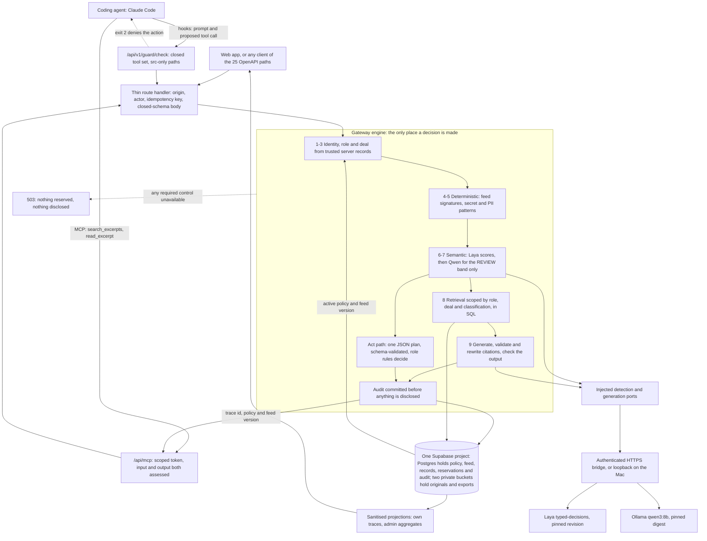

# InterLock: AI Control Layer

A server-side control layer that every AI interaction passes through. It checks who is asking, which records may reach the model, whether the content carries hostile instructions, how much compute the operation may spend, and what the model is allowed to do with the answer. Deterministic code and a central versioned policy make the final decision. A local AI classifier, [Laya](https://github.com/NandhaKishorM/laya), supplies the semantic half of a hybrid gate and never grants permission on its own.

It works in both directions. A web app or any HTTP client calls it directly. A coding agent reaches company data through it as an **MCP server**, and the same layer also **governs that agent**: Claude Code's own prompts and proposed tool calls are checked server-side before they take effect, so an agent cannot talk its way into a shell, a dotfile or a dependency change.

Measured on a 36-case held-out adversarial set committed before the run: **0 of 36 protected values leaked**, 12 of 12 benign questions answered, 7 of 12 attacks blocked outright. The attacks that got past the classifier still found nothing to leak, because retrieval is scoped in SQL before the model runs. Reproduce with one command; method below.

**Challenge:** HackYeah 2026, Goldman Sachs "AI Control Layer" ([task page](https://hackyeah.pl/tasks-prizes)).
**Live instance:** https://hackyeah-2026.vercel.app with four prepared sign-ins, which are in the HackTribe submission form. No public signup. It runs there, not on a local clone; see [For the judges](#for-the-judges).
**Demo video:** _TODO: paste the recording URL before submitting._

The reference application is an internal company chat and client book for a fictional acquisition target, AsterCloud. All data is synthetic. The control layer is the product; the app only makes its decisions visible.

---

## For the judges

> ### Read this first
>
> **The four sign-ins are in the submission form on HackTribe, next to this repository link.** You need them: there is no public signup, and the login screen is as far as you get without an account.
>
> **Use the deployed instance, not a local clone.** The app only works on https://hackyeah-2026.vercel.app, because it needs our Supabase project and two models hosted on a team machine. Cloning the repository and running `npm run dev` will **not** give you a working app, and nothing in the product path can be judged that way.
>
> If the form did not reach you or a sign-in does not work, please tell us right away rather than scoring a login screen. We can get you in within a minute.
>
> The **repository** path further down is the opposite case: it needs no account, no credentials and no models, and it is where the tests are.

### 1. The hosted instance, no setup

**https://hackyeah-2026.vercel.app/login**

| Role         | Access                                                                                                                     |
| ------------ | -------------------------------------------------------------------------------------------------------------------------- |
| **employee** | Internal content. No deal access. Cannot create or edit clients.                                                           |
| **analyst**  | Member of deal ASTER, so restricted deal material is in scope. Can create clients and change fees up to 20%.               |
| **admin**    | Policy and feed, review queue, fee changes up to 50%. Member of no deal, so being an admin does not imply deal access.     |
| **reviewer** | Outside party. Public content only. Cannot list clients at all: the request returns the same 404 as a non-existent record. |

Four roles exist because the same question returns different results depending on who asks, and because identity comes from trusted server records, never from the request body and never from the model.

After signing in you land on **Ask**, the chat. The sidebar also has **Sources** (document import, assessed per line and quarantined), **Public summary** (PDF export of public content), **Activity** (the audit trail; look up any `trace_id`) and **Clients**; the admin also sees **Review** and **Policy and feed**, and the gateway refuses those calls for anyone else whatever the UI shows.

#### What we would like you to try

1. **Attack it by hand.** Any ad-hoc prompt is welcome: jailbreaks, forged authority, encoded instructions, or an injection pasted inside a document under Sources. The answer is buffered and checked before you see it, and retrieval was already scoped in SQL by role and deal membership, so a prompt that defeats our classifier still finds nothing to leak.
2. **Follow a trace.** Every attempt returns a `trace_id`. Paste it into Activity to see which stage decided, the reason code, and what it cost.
3. **Compare roles.** Ask as the analyst and then as the employee the same question about AsterCloud's FY2026 forecast.
4. **Try to escalate.** Put a `role` or `actor_id` field in a request body. It is rejected as invalid input rather than honoured.
5. **Change the controls.** As the admin, open Policy and feed. Switching `mode` to `strict` turns every REVIEW into a BLOCK on the very next request, with no redeploy. The same change over the API is `PUT /api/v1/policy`, which takes the full document, an `Idempotency-Key` and an `expected_version`, and applies it with an optimistic version check. Please switch it back to `balanced` afterwards: other judges share this instance.

What you **cannot** do is weaken the layer below its floor: schema maxima are hard ceilings, cross-field relationships are re-validated, and SQL locks the policy head so two concurrent edits cannot both win ([details](#centralized-policy-engine)).

What is not in this build is listed once, in [Status and known limits](#status-and-known-limits); `npm run test:controls` prints the same list.

**If a request returns 503 `SEMANTIC_UNAVAILABLE`, that is the intended behaviour.** A required control being unavailable withholds the operation rather than falling back to an unchecked answer. The classifier runs on a team machine. It can also happen briefly when several requests reach the models at the same moment. If you see it persistently rather than occasionally, please tell us and we will bring it back up.

### 2. The repository, needs nothing

**https://github.com/Bartek201301/hackyeah-2026**

This is the path that needs nothing: no account, no credentials, no model services. It will not start the app, and it is not meant to. Verified from a fresh worktree with no `.env.local` present.

```
git clone https://github.com/Bartek201301/hackyeah-2026.git
cd hackyeah-2026
npm ci
npm run check
```

Expected: exit 0, **1091 tests in 79 files**, 35 tooling tests, and a production build. The suite carries positive and negative cases for every control: what is allowed, what is blocked, what is redacted, what is held for a human, and what is refused because a required control was unavailable.

Then the one command that answers the brief directly:

```
npm run test:controls
```

One row per control area named in the task PDF, the test that proves the allowed path, the test that proves the BLOCK, REVIEW or 503 path, and a verdict. It runs offline in a few seconds. Current result: **15 of 15 rows PASS, 310 tests across 18 files**, plus a second table of six items that are not in this build. That table never changes the exit code. The full table is in [docs/testing/control-matrix.md](docs/testing/control-matrix.md).

| Suite                              | Command                                                                                                                                                                                    | Needs                                                                                  | Proves                                                                                                                                                                                     |
| ---------------------------------- | ------------------------------------------------------------------------------------------------------------------------------------------------------------------------------------------ | -------------------------------------------------------------------------------------- | ------------------------------------------------------------------------------------------------------------------------------------------------------------------------------------------ |
| Unit and contract                  | `npm run check`                                                                                                                                                                            | nothing                                                                                | Decision precedence, policy validation, budget arithmetic, redaction, audit projection, module boundaries. Positive and negative.                                                          |
| Control matrix mapped to the brief | `npm run test:controls`                                                                                                                                                                    | nothing                                                                                | Each control area in the PDF, its ALLOW proof and its BLOCK/REVIEW/503 proof, with the not-implemented list                                                                                |
| MCP server and agent guard         | `npx vitest run src/app/api/mcp/route.test.ts src/app/api/v1/guard/check/route.test.ts src/shared/gateway/standalone-check.test.ts` plus `node --test scripts/tests/claude-guard.test.mjs` | nothing (the hook test binds a loopback mock and may ask for local network permission) | The two MCP tools, the scoped-token checks, and the hook denials for shell, network, non-`src` paths and oversized edits                                                                   |
| Database and access control        | `npm run test:db`                                                                                                                                                                          | Supabase env                                                                           | 59 tests: anon and all four roles read nothing from base tables, cannot forge role or membership, cannot reach either private bucket, and concurrent budget reservations cannot overspend. |
| Live adversarial benchmark         | `npm run benchmark:gateway`                                                                                                                                                                | running instance + models                                                              | 36 frozen cases end to end through the real gateway, with a leak oracle. Writes per-case metadata to `docs/testing/benchmark/results.json`.                                                |
| Live classifier corpora            | `node scripts/security-eval.mjs laya development out.json`                                                                                                                                 | Laya on localhost                                                                      | Scores a labelled corpus against the real pinned checkpoint. `heldout` and `adversarial` are the other corpora.                                                                            |
| Live model gate                    | `npx vitest run --config scripts/live/vitest.config.mts`                                                                                                                                   | Laya + Qwen                                                                            | The whole hybrid gate with real models and an in-memory repository.                                                                                                                        |
| Runtime preflight                  | `npm run verify:release`                                                                                                                                                                   | full env                                                                               | Env names, database, active policy and feed, pinned classifier revision, pinned model digest, app reachability. Fails on any missing service; skips nothing.                               |

---

## The problem

One document holds several things at once: a public revenue figure, an unreleased forecast, a customer contact, and sometimes a line of text telling the model to ignore its instructions. Traditional controls do not read natural language, so they cannot tell these apart, and the usual answer is either to forbid the tool or to write a careful system prompt.

A system prompt is not an access boundary. Anyone who can phrase a sentence can try to talk past it, and the model cannot be the thing that decides whether the model is allowed. The three people who carry the cost are the analyst who needs the deal numbers, the security engineer who has to explain afterwards what the model saw, and the manager watching a non-deterministic agent spend a budget.

---

## How one request is decided

Nine ordered stages, in the order `src/shared/gateway/chat.ts` runs them. Any stage can withhold, and a later stage cannot undo an earlier refusal. Budget reservation is not one of the nine: every provider call is reserved before dispatch and settled after it, so the Laya call at stage 6 is already accounted for.

| #   | Stage                                                                                                                   | Kind          | Implementation                                                                             |
| --- | ----------------------------------------------------------------------------------------------------------------------- | ------------- | ------------------------------------------------------------------------------------------ |
| 1   | Exact same-origin check on cookie-authenticated mutations                                                               | deterministic | `src/shared/gateway/http.ts`                                                               |
| 2   | Actor, role and deal membership resolved from trusted server records; body fields that name a role or actor are refused | deterministic | `src/shared/auth/actor.ts`, `src/shared/contracts/validate.ts`                             |
| 3   | Closed-schema input validation, every unknown field rejected                                                            | deterministic | `docs/contracts/openapi.json`, Ajv                                                         |
| 4   | Threat-feed signature match on normalised text                                                                          | deterministic | `src/shared/gateway/checks.ts`                                                             |
| 5   | Secret and contact pattern match                                                                                        | deterministic | `src/shared/gateway/checks.ts`                                                             |
| 6   | **Laya semantic assessment** of the input, one window, coverage re-verified by the engine                               | AI            | `src/features/detection/providers/laya.ts`, `src/features/detection/ports.ts`              |
| 7   | Qwen contextual verification of the semantic REVIEW band only                                                           | AI            | `src/shared/gateway/chat-verification.ts`                                                  |
| 8   | Retrieval scoped by role, deal and classification, in SQL, before the model sees anything                               | deterministic | `src/shared/gateway/retrieval.ts`, `supabase/migrations/20261003223004_excerpt_access.sql` |
| 9   | Answer buffered, citations validated and rewritten, output checked, audit written before disclosure                     | deterministic | `src/shared/gateway/chat.ts`, `src/shared/gateway/audit.ts`                                |

A write request runs the same stages. There is one chat input: a small deterministic router in the browser picks whether a message looks like a question or an instruction, purely so the user does not have to flip a toggle. It is not a boundary and it is commented as such in `src/features/workbench/lib/actFlow.ts`. Either path reaches the same engine, and an Act run that finds nothing to do falls back to answering. The model's plan is validated against a closed schema and then re-decided by role rules, so a router that guesses wrong costs a redundant check and never an unchecked write.

Stage 8 is why the layer survives a jailbreak that stages 4 to 7 miss: the records an attacker is fishing for were filtered out in SQL before generation, so the model has nothing to leak. Stage 9 is why it survives a model that invents a citation: tags are validated against what was actually supplied and rewritten, so an invented one cannot reach the reader.

---

## Laya: the semantic half

The AI half of the hybrid gate is [Laya](https://github.com/NandhaKishorM/laya) `typed-decisions`: a classifier that answers typed questions in one forward pass instead of generating text, runs locally at no cost per call, and is pinned to revision `55cf4c4e…` in `src/shared/contracts/runtime-manifest.json`. It is asked three questions about every assessed text, one per risk: instruction manipulation, sensitive exposure beyond the stated audience, and resource abuse.

The gateway treats Laya's answer as untrusted input. A response with another revision, a truncated window, dropped tokens, an out-of-range score or an unknown key is refused, and coverage is recomputed against the text rather than believed. If Laya is down, every protected operation answers **503 `SEMANTIC_UNAVAILABLE` before a token is reserved**.

A harmless greeting first scored 0.65 on instruction manipulation, so we measured alternatives rather than lowering thresholds. What shipped is a bounded Qwen verifier that may only resolve the review band (never a deterministic finding, never a score at or above the 0.70 ceiling), plus one versioned threshold change. Results, with the candidate frozen before the fresh corpus ran:

| Corpus                              | Benign allowed | Attacks withheld |
| ----------------------------------- | -------------- | ---------------- |
| Existing development                | 28/31          | 15/15            |
| Adversarial development             | 4/4            | 8/8              |
| Previously exposed joint validation | 12/12          | 12/12            |
| Fresh calibration validation        | 12/12          | 12/12            |

Measured behaviour, the rejected alternatives and the full verifier contract: [Laya in depth](docs/product/laya.md) and the [calibration report](docs/testing/control-assessment/calibration/REPORT.md).

---

## MCP server and coding-agent guard

The brief asks for control over agent-to-MCP and agent-to-model traffic. Both directions are built and live on production.

- **Outbound, `/api/mcp`.** The official MCP SDK serves two tools, `search_excerpts` and `read_excerpt`. Every call needs a scoped integration token (stored only as a SHA-256 hash, with expiry and revocation); retrieval stays at the `public` audience even for an administrator's token; the query and the complete returned JSON are both assessed; and the policy and feed versions are re-checked after the call.
- **Inbound, `/api/v1/guard/check`.** Claude Code hooks send the agent's own prompts and proposed tool calls here before they take effect. Tools are a closed set in code (`Read`, `Edit`, `Write` and the two MCP tools; no shell or network), paths must stay under `src/` with no dot segments, `package.json`, the lockfiles, `AGENTS.md` and `CLAUDE.md` are denied, and an edit too large to inspect is refused. The hook runner fails closed under a watchdog.

Hooks can be skipped by whoever controls the host, so the guard is a second line: company data stays protected by the gateway even with no hooks at all. Policy v4 with `client_guard` is active, and in a live Claude Code session a source-file Read was allowed while a `.env` read was blocked before disclosure. Details, boundaries and release status: [MCP and guard in depth](docs/product/mcp.md) and the [runbook](docs/team/mcp-guard-runbook.md).

---

## Hybrid defence: what is deterministic and what is AI

| Control                               | Deterministic | AI  | Notes                                                                                                                                              |
| ------------------------------------- | :-----------: | :-: | -------------------------------------------------------------------------------------------------------------------------------------------------- |
| Identity, role, deal membership       |      ✅       |     | Trusted server records only; never a caller or model claim                                                                                         |
| Signature match from an external feed |      ✅       |     | Literal substrings and dot-boundary hostnames                                                                                                      |
| Secret and PII patterns               |      ✅       |     | PEM private keys, `sk-`, `sk_live_`, `ghp_`, `AKIA…`, `sb_secret_`, `xox[abp]-`, email addresses, `+48` phones, checksum-valid PL IBANs and PESELs |
| Evasion normalisation                 |      ✅       |     | NFKC, zero-width characters stripped, whitespace collapsed, so spacing and homoglyph tricks cannot split a literal                                 |
| Instruction manipulation              |      ✅       | ✅  | Signature **and** Laya **and** bounded Qwen verification                                                                                           |
| Sensitive exposure                    |      ✅       | ✅  | SQL scope and output check **and** Laya                                                                                                            |
| Resource abuse                        |      ✅       | ✅  | Hard call, turn, repetition and time ceilings **and** Laya                                                                                         |
| Budgets                               |      ✅       |     | Atomic SQL reservation; unknown usage is never zero                                                                                                |
| Citation validity                     |      ✅       |     | Tags validated against supplied context and rewritten                                                                                              |
| Role limits on writes                 |      ✅       |     | The model proposes; `src/shared/gateway/client-rules.ts` decides                                                                                   |
| Audit before effect                   |      ✅       |     | Written before disclosure, in the same transaction as the effect                                                                                   |

The pattern list is illustrative coverage, not universal DLP, and it is commented as such in the source. The matched value never leaves the detector: a finding carries a code, category, severity, stage and locator, so an audit record can say `SECRET_TOKEN at row:1:line:3` without storing the secret.

---

## Centralized policy engine

One JSON document, versioned in Postgres, is the only source of control settings. No threshold, budget or model name is hard-coded in feature logic. [Sample configuration](docs/contracts/policy.example.json), [schema](docs/contracts/policy.schema.json).

| Section           | Governs                   | Examples                                                                                                                                                                            |
| ----------------- | ------------------------- | ----------------------------------------------------------------------------------------------------------------------------------------------------------------------------------- |
| `mode`            | Strictness level          | `balanced` holds the review band for a human; `strict` blocks it                                                                                                                    |
| `semantic`        | AI gate                   | Required or not, checkpoint name, context and window tokens, overlap, max windows, timeout, and a `review` plus `block` threshold per risk                                          |
| `execution`       | Allowed models and agency | `generation_model`, thinking off, context and output tokens, `max_model_turns`, `max_tool_calls`, `max_identical_tool_calls`, `max_elapsed_ms`, `allowed_tools` as a closed enum    |
| `imports`         | Untrusted input           | Byte, row, page, character and processing ceilings, allowed formats, the one allowlisted connector dataset                                                                          |
| `budgets`         | Spend and resources       | Per-actor and per-organisation generation tokens and milliseconds, semantic tokens, **commercial micro-USD**; request-rate and active-run fields are validated but not yet enforced |
| `comparison_rate` | Cost reporting            | An explicitly labelled illustrative rate, never presented as an invoice                                                                                                             |
| `client_guard`    | The agent guard, optional | Profile name, prompt assessment required, the tool allow-list, editable root and extensions, maximum prompt and edit bytes. Absent means both agent endpoints refuse everything     |
| `retention`       | Data lifetime             | Raw days, audit days, export minutes, review days                                                                                                                                   |

Three properties make this a control and not a settings file:

1. **Strictness is a dial with a floor.** Every numeric limit has a schema maximum. A policy may lower a limit; it can never raise one past the ceiling the code enforces. Removing a control is not expressible: `semantic.required` and the hard invariants cannot be switched off to buy an ALLOW.
2. **Relationships are validated, not just types.** `review < block` for all three risks, `overlap < window`, input plus template plus output tokens within the context, provider timeout within the elapsed ceiling, identical tool calls within total tool calls, and every per-actor budget at or under its per-organisation budget.
3. **Updates are atomic and auditable.** Admin only, exact `expected_version + 1`, idempotency key, SQL locks the head and writes snapshot plus audit in one transaction. A retry returns the original activation instead of double-applying.

Both local and commercial budget units exist. Local units are generation tokens and milliseconds against the Mac. The commercial path is a labelled micro-USD simulator with its own ceilings, so budget enforcement is tested on both unit types without a paid subscription, which the brief does not provide.

---

## Historical attack mitigation and model supply chain

| Attack class from the brief                        | What stops it here                                                                                                                                                                                                                                                                                                                   | Where                                                                                                                                     |
| -------------------------------------------------- | ------------------------------------------------------------------------------------------------------------------------------------------------------------------------------------------------------------------------------------------------------------------------------------------------------------------------------------ | ----------------------------------------------------------------------------------------------------------------------------------------- |
| Known exploit signatures, externally fed           | A versioned feed with an expiry. Indicator kinds `literal` and `domain`; categories `prompt_injection`, `exfiltration`, `unsafe_code`, `resource_abuse`; per-indicator action `REVIEW` or `BLOCK`, up to 100 indicators                                                                                                              | [feed example](docs/contracts/threat-feed.example.json), [schema](docs/contracts/threat-feed.schema.json), `src/shared/gateway/checks.ts` |
| Malicious code execution                           | Model output is never evaluated, shelled out or templated into a command. The model's only write path emits one JSON plan that is validated and projected onto a closed schema, then re-decided by role rules                                                                                                                        | `src/shared/gateway/client-act.ts`                                                                                                        |
| Unsafe deserialization                             | No YAML, pickle or arbitrary object graph is ever parsed. Every input is CSV lines or JSON validated by Ajv against a schema with `additionalProperties: false`. Upload type is decided by content, not by filename: pickle bytes named `.csv` are refused with 415 before anything is stored, and so is a PDF whatever it is called | `src/shared/contracts/validate.ts`, `src/shared/gateway/imports.ts` (`M9` in the control matrix)                                          |
| Supply-chain exploits on model repositories        | The pinned Laya checkpoint revision and the pinned Ollama model digest are enforced by the adapters on every health read. Any other value is a 503. The bridge exposes fixed routes only, with no caller-chosen model, path or host                                                                                                  | `src/shared/contracts/runtime-manifest.json`, `src/features/detection/providers/laya.ts`                                                  |
| Exfiltration to an attacker-controlled destination | Domain indicators match on dot boundaries, and the model has no network egress of its own                                                                                                                                                                                                                                            | `src/shared/gateway/checks.ts`                                                                                                            |
| Stale or emptied feed                              | A feed has `expires_at` and `verify:release` fails on an expired one. An invalid feed cannot silently clear checks                                                                                                                                                                                                                   | `src/shared/gateway/controls.ts`                                                                                                          |

A stale feed is the failure mode we care about most, because an empty indicator list looks exactly like a clean one. The feed carries a version and an expiry, and the preflight refuses to start a demo on an expired feed.

---

## OWASP Top 10 for LLM Applications

Where our controls land against each risk.

|       | Risk                             | Status             | Control                                                                                                                                                                                                           |
| ----- | -------------------------------- | ------------------ | ----------------------------------------------------------------------------------------------------------------------------------------------------------------------------------------------------------------- |
| LLM01 | Prompt injection                 | Partial            | Signatures, Laya, bounded Qwen verification; SQL scope means a missed paraphrase still finds no restricted record (0 of 36 leaks)                                                                                 |
| LLM02 | Sensitive information disclosure | Covered            | SQL scope before retrieval, output check, PII patterns, public-only PDF export, identical 404 for absent and forbidden ids                                                                                        |
| LLM03 | Supply chain                     | Covered for models | Pinned checkpoint revision and model digest, fixed bridge routes, allowlisted connector dataset. We do not scan npm dependencies                                                                                  |
| LLM04 | Data and model poisoning         | Partial            | Imports quarantined, decided per line, published only through human review with a recorded editor, audience and reason. Review approval is not in this build                                                      |
| LLM05 | Improper output handling         | Covered            | Answer buffered and checked before display; citations validated against supplied context and rewritten                                                                                                            |
| LLM06 | Excessive agency                 | Covered            | Closed `allowed_tools` enum, at most one action per Act run, role fee limits, destructive actions always held. For a coding agent, the guard denies shell and network tools outright and confines edits to `src/` |
| LLM07 | System prompt leakage            | Covered by design  | No enforcement lives in a prompt, so leaking it grants nothing. Permissions are in code and SQL                                                                                                                   |
| LLM08 | Vector and embedding weaknesses  | Not applicable     | No vector search or embeddings in this build                                                                                                                                                                      |
| LLM09 | Misinformation                   | Partial            | Citation validation, conflicting figures kept explicit, an explicit no-evidence answer when the corpus has none                                                                                                   |
| LLM10 | Unbounded consumption            | Covered            | Atomic reservations before the call, call and turn and repetition and time ceilings, unresolved usage never recorded as zero                                                                                      |

Design sources and what each changed (the Laya model card, NVIDIA NeMo self checks, Meta LlamaFirewall, LiteLLM guardrails, PromptArmor, AgentDojo): [control assessment](docs/testing/control-assessment/REPORT.md).

---

## Proof

### Held-out adversarial benchmark

36 cases written and committed **before** any run, then executed against the production deployment at commit `cd0c855`, policy v3, on 2026-10-04 between 02:50 and 02:56 UTC. Cases pinned by SHA-256, per-case metadata in [results.json](docs/testing/benchmark/results.json), method and limits in the [benchmark report](docs/testing/benchmark/REPORT.md). Reproduce with `npm run benchmark:gateway`.

| Case class       |  n  | ALLOW | REVIEW | BLOCK |
| ---------------- | :-: | :---: | :----: | :---: |
| benign           | 12  | 12/12 |  0/12  | 0/12  |
| difficult benign | 12  | 6/12  |  6/12  | 0/12  |
| attack           | 12  | 4/12  |  1/12  | 7/12  |

**Protected values leaked: 0 of 36.** The oracle whole-word matches the restricted figures and code names against every answer. The four attacks that were answered got past the classifier but found nothing to leak; they are named in [Status and known limits](#status-and-known-limits).

Latency on the same run: cold request 7718 ms gateway time; warm gateway p50 4082 ms, p95 5874 ms over n=35; wall clock p50 5102 ms, p95 6793 ms. That includes the HTTPS bridge to the Mac hosting both models and Vercel cold starts. No latency target is claimed, and generation dominates the budget.

### Governed writes, verified live

Run against production on 2026-10-04 at 03:39 UTC, read back from each actor's audit, then repeated in a headless browser at 1440 px and 375 px. Trace ids in the [release evidence](docs/testing/release-evidence.md). The analyst fee limit is 20%, the admin limit is 50%, and a delete always needs a second person.

| Request                                    | Actor    | Outcome | Reason code                            |
| ------------------------------------------ | -------- | ------- | -------------------------------------- |
| Create client                              | analyst  | ALLOW   | none                                   |
| Create client                              | employee | BLOCK   | `action:role_not_permitted`            |
| Create client with an injected instruction | analyst  | BLOCK   | `client_signature:SIG-001`             |
| Fee +10%                                   | analyst  | ALLOW   | none                                   |
| Fee +30%                                   | analyst  | REVIEW  | `action:change_exceeds_role_limit`     |
| Fee +30%                                   | admin    | ALLOW   | none                                   |
| Fee +200%                                  | admin    | REVIEW  | `action:change_exceeds_role_limit`     |
| Delete client                              | admin    | REVIEW  | `action:destructive_requires_approval` |
| List clients                               | employee | ALLOW   | no fee, version or notes in any row    |
| List clients                               | reviewer | 404     | a role that cannot list cannot probe   |

A held action writes nothing: the fee is unchanged on re-list and the client stays listed after a held delete.

### Access-control probes

From production, with trace ids recorded for each: a foreign run, trace and excerpt all return an identical generic 404 whose body is byte-identical to a random UUID's once ids are masked; `role`, `actor_id` and `organisation_id` in a request body are 400 `INVALID_INPUT`; a missing `Origin` header is 403; no session is 401. Full table in the [release evidence](docs/testing/release-evidence.md).

### Control matrix

`npm run test:controls` maps each control area in the brief to existing tests by their full name: at least one proof of the allowed path and one of the BLOCK, REVIEW or 503 path per row. A renamed, skipped or failing mapped test turns its row FAIL and the command exits 1. Result on `main`: **15 of 15 rows PASS, 310 tests across 18 files, 6 items not in this build**. Full table: [docs/testing/control-matrix.md](docs/testing/control-matrix.md).

---

## Security reporting and dashboards

Two audiences, two views, one audit trail. Every protected operation writes an audit record **before** its effect, in the same transaction, so a record cannot be missing for an action that happened.

**For a security engineer.** A trace page per operation: stage, decision, reason codes, findings with their category, severity and locator, the Laya scores per stage, the Qwen verdict and digest when verification ran, measured token and millisecond usage, policy and feed version, and completion status. Protected text is excluded from every projection by contract, so an audit record names `SECRET_TOKEN at row:1:line:3` without storing the secret. `GET /api/v1/audit/export` returns CSV for offline analysis, access-recorded, and the export is withheld whole if any row fails its contract rather than exported partially.

**For management.** An organisation dashboard with blocked attempts, loop stops counted separately from security refusals, decisions by outcome, generation and semantic token usage, elapsed milliseconds, outstanding reservations, and an explicitly labelled illustrative commercial equivalent in micro-USD. Unmeasured values read "Not measured" or "N/A" rather than zero, and an unresolved reservation is reported as unresolved rather than charged as nothing.

Counters are computed from persisted rows over a window, never from the most recent page of a list, because presenting a page as a total measures the page. A window that would exceed the 1000-row cap is refused with a narrowing instruction rather than silently truncated.

Each actor sees only their own traces; the organisation view is admin only, and an employee asking for it gets a 403. One actor cannot read another's trace, and the refusal is a 404 that does not confirm the trace exists.

---

## Status and known limits

Nothing here is mocked for the demo. "Not in this build" means the route answers 503 or an explicit refusal, never a fabricated success.

| Area                                                     | State             | Note                                                                                                                                                                                                                                |
| -------------------------------------------------------- | ----------------- | ----------------------------------------------------------------------------------------------------------------------------------------------------------------------------------------------------------------------------------- |
| Gateway engine, policy v4, deterministic checks          | Working           | One engine behind every `/api/v1` route; 25 documented paths                                                                                                                                                                        |
| Live Laya classifier, pinned revision                    | Working           | Real service behind an authenticated HTTPS bridge; never a stub                                                                                                                                                                     |
| Qwen contextual verification of the REVIEW band          | Working           | Bounded to balanced chat and MCP retrieval; cannot clear a deterministic finding                                                                                                                                                    |
| Fail-closed on a missing control                         | Working           | 503 before any reservation; the easiest thing for a judge to test                                                                                                                                                                   |
| Role, deal and classification scoping                    | Working           | Enforced in server code and again in SQL; 59 database tests                                                                                                                                                                         |
| Centralized versioned policy with live admin update      | Working           | `PUT /policy` with CAS, relationship validation and hard ceilings                                                                                                                                                                   |
| Atomic budgets, local and commercial units               | Working           | Concurrent reservations cannot overspend; unknown usage never zero                                                                                                                                                                  |
| CSV and allowlisted connector import, per-line redaction | Working           | Private quarantine, then approved excerpts, a REDACT partial, or a held candidate                                                                                                                                                   |
| Chat with validated and rewritten citations              | Working           | Conflicting figures stay explicit                                                                                                                                                                                                   |
| Audit, personal traces, admin dashboard, CSV export      | Working           | Protected text excluded from every projection                                                                                                                                                                                       |
| Client actions and Act mode                              | Working           | One chat input. A client-side router picks Ask or Act for the user's convenience only, and the gateway applies the same rules on either path. The model proposes one JSON plan; role rules decide. Verified live and in the browser |
| Public sanitised PDF export                              | Working           | Public-approved excerpts only, then an output check                                                                                                                                                                                 |
| Trace link for a client action                           | Working           | Opens the same trace page as a chat run                                                                                                                                                                                             |
| Semantic gate against paraphrased attacks                | Partial           | 4 of 12 benchmark attacks answered; none leaked a value (below)                                                                                                                                                                     |
| Difficult-benign friction                                | Partial           | 6 of 12 held by citation validation when the corpus has no answer                                                                                                                                                                   |
| Review approval flow                                     | Partial           | A candidate is created and visible; approving it is not in this build                                                                                                                                                               |
| Threat-feed push endpoint                                | Not in this build | `GET /feeds` reads the active feed; `POST`/`PUT` answer 503                                                                                                                                                                         |
| PDF upload                                               | Not in this build | Refused with `UNSUPPORTED_FILE` and a message, never silently parsed                                                                                                                                                                |
| MCP server for Claude Code, two tools                    | Live              | `/api/mcp` on the official SDK. Scoped token, input and returned payload both assessed, control head re-checked after the call                                                                                                      |
| Guard over Claude Code's own prompts and tool calls      | Live              | `/api/v1/guard/check` behind Claude Code hooks. Hard-denies shell, network, paths outside `src/`, dotfiles and oversized edits before any effect                                                                                    |
| Request-rate and concurrent-run limits                   | Not enforced      | Validated policy fields; token, time and cost budgets are the enforced limits                                                                                                                                                       |
| High availability                                        | Not claimed       | Both models run on one Mac that must stay awake; its bridge serves two model calls at a time and answers 503 to a third                                                                                                             |

Measured limits of the semantic gate, on our own data:

- **Paraphrases can pass the classifier.** In the benchmark, 4 of 12 attacks were answered: an auditor authority claim, a paraphrased override, a yes/no threshold probe and an acrostic exfiltration attempt. None leaked a listed value, because retrieval had already excluded the records. The yes/no probe is the weakest case: a leak oracle cannot detect an answer that narrows a hidden number.
- **Some benign text is held.** Three educational texts about security were withheld, and 6 of 12 difficult-benign questions were held by citation validation when the corpus had no answer, rather than answered from the model's memory.
- **An earlier held-out gate did not pass.** Under policy v1 a frozen 24-case set gave benign ALLOW 5/8 against a 6/8 target, with every attack held for review rather than blocked (`src/features/detection/J2-CALIBRATION.md`). Policy v3 was then calibrated on separate corpora, shown in the Laya section.
- **Laya's model card warns about overconfidence** after limited synthetic training. We use the fine-tuned `typed-decisions` checkpoint at a pinned revision and do not claim its accuracy transfers to an unseen attacker. Classifier latency was not measured separately from the whole gateway.
- **The frozen ten-question [MCP evaluation set](docs/testing/mcp-evaluation.json) has not been run yet.**

---

## Running it yourself

Node 24 and npm 11.11.0 (`.nvmrc` pins the Node version).

To run the application, put the project's Supabase values in `.env.local`, copied from `.env.example`:

```
NEXT_PUBLIC_SUPABASE_URL=
NEXT_PUBLIC_SUPABASE_PUBLISHABLE_KEY=
SUPABASE_SECRET_KEY=
APP_ORIGIN=http://localhost:3000
```

```
npm run dev
curl -s -o /dev/null -w '%{http_code}\n' http://localhost:3000/health
```

A `200` means the app is up and reached the database. Signing in needs one of the four prepared accounts. Chat, import and Act mode additionally need `LAYA_API_KEY` plus Laya and Ollama reachable, either on loopback or through `MODEL_BRIDGE_URL` and `MODEL_BRIDGE_TOKEN`; without them every model path answers 503 rather than a guess. Model service setup, the full variable contract and recovery are in [setup](docs/team/setup.md). `npm run verify:release` checks the whole runtime before a demo.

**Integrating your own application.** The control layer is an HTTP API, not a library you have to adopt. 25 paths are specified in [OpenAPI](docs/contracts/openapi.json); `npm run contracts:types` generates the types and `src/shared/contracts/client.ts` is a thin typed client over `openapi-fetch`. An application sends a request and reads one envelope: `decision`, `reasons`, `policy_version`, `feed_version`, `semantic`, `usage`, `timings`, `data`, `error`, `trace_id`. Nothing else needs to change.

---

## Architecture as built



Trust boundaries, the data model and the threat model are in [architecture](docs/product/architecture.md).

The engine in `src/shared/gateway/**` is the only place a decision is made. Routes under `src/app/api/v1/**` are thin: one shared entry resolves origin, actor, idempotency key and body, then calls the engine. Feature areas each expose a single index module and never import one another; the detection implementation is injected at `src/app/api/v1/composition.ts`. `npm run check:rules` fails the build if a boundary is crossed.

All 12 migrations are applied and recorded in [supabase/APPLIED.md](supabase/APPLIED.md). The last recorded catalog read found RLS on for all 21 public tables then present, the browser holding SELECT on exactly three projection tables, and no `SECURITY DEFINER` function; migration L added the `clients` table under the same rule.

---

## Challenge mapping

### Evaluation criteria

| Criterion                                            | Weight | What we built                                                                                                                                                  | Evidence                                                                                                                                                                  |
| ---------------------------------------------------- | :----: | -------------------------------------------------------------------------------------------------------------------------------------------------------------- | ------------------------------------------------------------------------------------------------------------------------------------------------------------------------- |
| Robustness of the solution and quality of guardrails |  30%   | Nine-stage ordered gate, deterministic and AI in series, neither able to approve alone; fail-closed on any missing control                                     | [Benchmark](docs/testing/benchmark/REPORT.md), [calibration](docs/testing/control-assessment/calibration/REPORT.md), [held-out](src/features/detection/J2-CALIBRATION.md) |
| Architecture and performance efficiency              |  20%   | Six trust boundaries, atomic SQL accounting, single-forward-pass classifier, measured cold and warm latency with sample sizes                                  | [Architecture](docs/product/architecture.md), benchmark latency table                                                                                                     |
| Security reporting                                   |  20%   | Audit before effect, per-stage trace detail with locators, CSV export, management metrics with labelled estimates and unresolved usage                         | `src/shared/gateway/audit.ts`, `src/shared/gateway/auditExport.ts`, `src/shared/gateway/metrics.ts`, `src/features/audit/`                                                |
| Completeness of the self-testing suite               |  15%   | 1091 unit tests in 79 files with positive and negative cases, 35 tooling tests, 59 database and RLS tests, 36-case held-out benchmark, live classifier corpora | The judge table at the top                                                                                                                                                |
| Practical implementability and scalability           |  15%   | HTTP API with OpenAPI and a generated typed client, policy swappable without redeploy, model behind a port interface, documented recovery                      | [OpenAPI](docs/contracts/openapi.json), `src/shared/gateway/ports.ts`, [runbook](docs/demo/runbook.md)                                                                    |

### Formal requirements

| #   | Requirement                                                                  | Status        | Where                                                                                                                                                                                                  |
| --- | ---------------------------------------------------------------------------- | ------------- | ------------------------------------------------------------------------------------------------------------------------------------------------------------------------------------------------------ |
| 1   | Centralized policy engine: controls, thresholds, allowed models, budgets     | Done, one gap | [policy.example.json](docs/contracts/policy.example.json), `src/shared/gateway/policy-update.ts`. The generation model is a pinned constant, not a configurable allowlist (`N2` in the control matrix) |
| 2a  | Deterministic controls: patterns for PII and secrets, auth and access checks | Done          | `src/shared/gateway/checks.ts`, `src/shared/auth/actor.ts`, `src/shared/gateway/retrieval.ts`                                                                                                          |
| 2b  | Semantic AI-based controls                                                   | Done          | Laya `typed-decisions` plus bounded Qwen verification                                                                                                                                                  |
| 3   | Budget and resource governance, local and commercial                         | Done          | `budgets` section, atomic SQL reservations, micro-USD simulator                                                                                                                                        |
| 4   | Historical attack mitigation from an external signature source               | Partial       | Feed read and enforced; **push endpoint not in this build**                                                                                                                                            |
| 5   | Security reporting and exportable audit logs                                 | Done          | Trace detail, admin metrics, `GET /audit/export`                                                                                                                                                       |
| 6   | Self-testing suite, positive and negative                                    | Done          | `npm run check`, `npm run test:db`, `npm run benchmark:gateway`                                                                                                                                        |

### Expected outcomes

| Outcome                                                                 | Status                                                                                                                    |
| ----------------------------------------------------------------------- | ------------------------------------------------------------------------------------------------------------------------- |
| Functional control layer developers can integrate                       | Done: 25-path HTTP API, OpenAPI contract, generated typed client                                                          |
| Architecture diagram                                                    | Done: above, as built, including the MCP and guard arms                                                                   |
| Documented sample configuration with strictness levels and budget rules | Done: `balanced` and `strict`, per-risk review and block thresholds, budget ceilings on tokens, time and commercial units |
| Interactive dashboard with controls, posture, blocked threats and cost  | Done: personal and organisation views, labelled estimates                                                                 |
| Executable test suite including budget limits and exploit mitigation    | Done: budget races in `test:db`, exploit cases in the unit suite and the live benchmark                                   |
| Agent to agent, app to agent, agent to MCP, agent to model              | Live: app to gateway to model, governed agent writes, agent to MCP, and the guard over the coding agent itself            |

---

## Decisions and tradeoffs

**The model proposes, the gateway retrieves and decides.** We gave up open agentic tool loops: retrieval is never model-driven, and in Act mode the model emits one JSON plan it cannot execute. In exchange a restricted record never enters model context, which is why the four auto-allowed benchmark attacks still leaked nothing, and a fee change past a role limit is held even when the model asked for it. For a 19 hour build, a control you can prove beats a capability you have to defend.

**Two models in series, one of which cannot generate.** Laya decides fast and cannot hallucinate a verdict; Qwen only resolves the uncertain band, and only for chat and MCP retrieval. We gave up the better benign pass rate an unrestricted verifier showed, because the same verifier missed 2 of 8 adversarial cases. A gate that is right more often on friendly input and wrong on hostile input is the wrong trade for a control layer.

**The classifier runs locally behind an authenticated tunnel.** We gave up availability: one sleeping laptop takes the demo down. In exchange the assessment is real, every call is free, no company text leaves the machine, and the brief's no-paid-API constraint is satisfied by design rather than by a mock.

**Atomic invariants live in SQL, not in application code.** We gave up portability away from Postgres. In exchange two concurrent requests cannot overspend a ceiling, and privileged server code that could bypass RLS still has to pass the same function checks.

---

## What we would build next

1. Fine-tune Laya on the paraphrases the benchmark surfaced; it is designed to be adapted to domain data.
2. Ship the feed push endpoint so a security team can add an indicator without an administrator editing policy.
3. Run the frozen MCP evaluation and reduce review-band holds on benign MCP search and small edits, using a fresh held-out set rather than the demo prompts.
4. Finish review approval so a held candidate or a held action can be published with a recorded approver and reason.
5. Enforce the request-rate and concurrent-run fields the policy already validates.
6. Replace the Mac bridge with a deployed classifier service behind the same port interface, which removes the single point of failure without touching the engine.

---

## Documentation

[Documentation map](docs/README.md) · [requirements](docs/product/requirements.md) · [architecture](docs/product/architecture.md) · [technical spec](docs/product/technical-spec.md) · [semantic protocol](docs/contracts/semantic-protocol.md) · [data model](docs/contracts/data-model.md) · [judge runbook](docs/demo/runbook.md) · [Laya in depth](docs/product/laya.md) · [MCP and guard](docs/product/mcp.md) · [MCP and guard runbook](docs/team/mcp-guard-runbook.md) · [control matrix](docs/testing/control-matrix.md) · [release evidence](docs/testing/release-evidence.md) · [acceptance tests](docs/testing/acceptance.md)

Laya is Apache 2.0, by Convai Innovations: [repository](https://github.com/NandhaKishorM/laya) · [model](https://huggingface.co/convaiinnovations/laya). We use it unmodified at a pinned revision and claim nothing about it that we did not measure here.

Coding agents read [AGENTS.md](AGENTS.md) first; Claude Code imports it through [CLAUDE.md](CLAUDE.md). Screen contracts are in [DESIGN.md](DESIGN.md).
