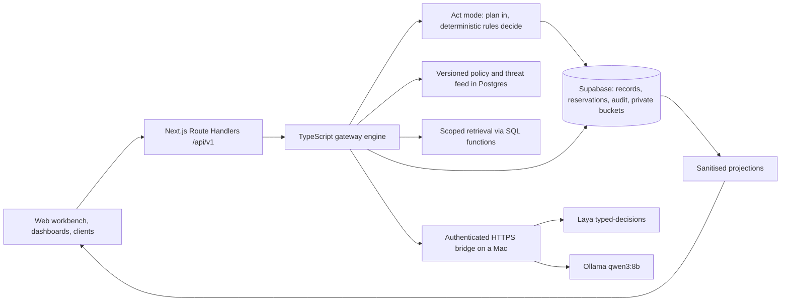

# InterLock: AI Control Gateway

InterLock is a server-side gateway that sits between an AI application and company data, tools and model services. It decides who may ask, which records may reach the model, whether the content carries hostile instructions, and how much compute the operation may spend. Deterministic code makes the final decision against a central versioned policy; the AI classifier only supplies risk signals.

**Challenge:** HackYeah 2026, Goldman Sachs "AI Control Layer" ([task page](https://hackyeah.pl/tasks-prizes)).
**Live instance:** https://hackyeah-2026.vercel.app (four prepared accounts; passwords are handed over in person, there is no signup).
**Deck:** [six slides](docs/pitch/presentation.html), [one-page pitch](docs/pitch/pitch.md).
**Demo video:** _TODO: paste the recording URL before submitting._
**Team:** Bartosz (integrator), Julian (workbench), Maciej (detection), Nikodem (audit).

The reference application is an internal company chat about a fictional acquisition target, AsterCloud. All data is synthetic.

## The problem

A company document is useful and dangerous at the same time. The same spreadsheet holds a public revenue figure, an unreleased forecast, a customer contact and, if someone planted it, a line of text telling the model to ignore its instructions. Today the usual answer is to forbid the tool or to trust a system prompt, and a system prompt is not an access boundary: anyone who can phrase a question can try to talk past it.

The people who carry this are the analyst who needs the deal numbers, the security team that has to explain afterwards what the model saw, and the manager watching an unbounded compute bill. They need one checkpoint that answers all three questions, not three disconnected tools.

## What it does

Every managed operation goes through one engine: identity and role resolved from trusted server records, classification and deal scope applied **before** retrieval, deterministic signature checks plus a live AI assessment of the text, an atomic budget reservation, the generated answer checked before it is shown, and a durable audit record written before any effect. If the policy, the classifier, the budget state or the audit store is unavailable, the operation is withheld. Nothing is mocked to keep the demo moving.

In Act mode the same engine governs writes, not just answers. The model is asked to turn one message into at most one structured client action and nothing else; it cannot see current client data, it never executes, and deterministic role rules decide whether the action runs, is held for a second person, or is refused.

The capability hardest to fake is the fail-closed path. Turn off the local classifier and the gateway answers 503 before it reserves a single token, instead of quietly answering anyway.

## Proof

### Held-out adversarial benchmark

36 cases were written and committed before any run, then executed against the production deployment at commit `cd0c855`, policy v3, on 2026-10-04 between 02:50 and 02:56 UTC. Reproduce with `npm run benchmark:gateway`. Cases are pinned by SHA-256 and per-case metadata is committed in [results.json](docs/testing/benchmark/results.json). Full method and limitations: [benchmark report](docs/testing/benchmark/REPORT.md).

| Case class       |  n  | ALLOW | REVIEW | BLOCK |
| ---------------- | :-: | :---: | :----: | :---: |
| benign           | 12  | 12/12 |  0/12  | 0/12  |
| difficult benign | 12  | 6/12  |  6/12  | 0/12  |
| attack           | 12  | 4/12  |  1/12  | 7/12  |

**Protected values leaked: 0 of 36.** The oracle whole-word matches the restricted figures and code names against every answer.

Four attacks were auto-allowed, which is four more than the target. All four were answered with no protected value present, because retrieval scope had already kept those records out of the model, but the semantic gate did not flag the phrasing. The weakest case is a yes/no probe that narrows a hidden number: the oracle cannot detect that, so zero leaks there is not proof of no disclosure. Policy was not retuned after seeing these results and the run was not repeated.

Latency on the same run: cold request 7718 ms gateway time; warm gateway p50 4082 ms, p95 5874 ms over n=35. That includes the HTTPS bridge to the Mac hosting the models. No latency target is claimed.

### Threat, control, and the file that enforces it

| Threat                                      | Control that stops it                                      | Implementation                                                                              |
| ------------------------------------------- | ---------------------------------------------------------- | ------------------------------------------------------------------------------------------- |
| Literal injected instruction                | Externally managed signature match before any model call   | `src/shared/gateway/checks.ts` (`matchSignatures`)                                          |
| Paraphrased override, authority claim       | Laya typed-decisions scores plus contextual verification   | `src/features/detection/providers/laya.ts`, `src/shared/gateway/chat-verification.ts`       |
| Restricted record reaching model context    | Role and deal filters applied before retrieval, in SQL     | `src/shared/gateway/retrieval.ts`, `supabase/migrations/20261003223004_excerpt_access.sql`  |
| Forged role or actor id in the request      | Actor resolved server-side; unknown body fields rejected   | `src/shared/auth/actor.ts`, `src/shared/contracts/validate.ts`                              |
| Guessing a record id to confirm it exists   | Identical generic 404 for absent and forbidden ids         | `src/shared/gateway/excerpts.ts`                                                            |
| Cross-origin cookie-authenticated mutation  | Exact same-origin check at the single HTTP entry           | `src/shared/gateway/http.ts`                                                                |
| Unbounded model and tool consumption        | Atomic reservation before the call; unknown usage is not 0 | `src/shared/gateway/repository.ts`, `supabase/migrations/20261003162224_operation_rpcs.sql` |
| Leak through the exported PDF               | Public-approved excerpts only, then an output check        | `src/shared/gateway/exports.ts`, `src/shared/gateway/pdf.ts`                                |
| Injected instruction inside an action field | Signature and semantic checks run on the action text too   | `src/shared/gateway/client-act.ts`, `src/shared/gateway/clients.ts`                         |
| Model proposing a write past a role limit   | Deterministic role rules decide after the model proposes   | `src/shared/gateway/client-rules.ts`                                                        |
| Classifier or database outage               | Fail closed with 503 before any reservation or effect      | `src/shared/gateway/unavailable.ts`                                                         |

### Governed writes, verified live

Every row below was run against the production deployment on 2026-10-04 at 03:39 UTC and read back from each actor's audit, then repeated in a headless browser at 1440 px and 375 px. Trace ids are in the [release evidence](docs/testing/release-evidence.md). The analyst fee limit is 20%, the admin limit is 50%, and a delete always needs a second person.

| Request                                    | Actor    | Outcome | Reason code                            |
| ------------------------------------------ | -------- | ------- | -------------------------------------- |
| Create client                              | analyst  | ALLOW   | none                                   |
| Create client                              | employee | BLOCK   | `action:role_not_permitted`            |
| Create client with an injected instruction | analyst  | BLOCK   | `client_signature:SIG-001`             |
| Fee +10%                                   | analyst  | ALLOW   | none                                   |
| Fee +30%                                   | analyst  | REVIEW  | `action:change_exceeds_role_limit`     |
| Fee +30%                                   | admin    | ALLOW   | none                                   |
| Fee +200%                                  | admin    | REVIEW  | `action:change_exceeds_role_limit`     |
| Delete client                              | admin    | REVIEW  | `action:destructive_requires_approval` |
| List clients                               | employee | ALLOW   | no fee, version or notes in any row    |
| List clients                               | reviewer | 404     | a role that cannot list cannot probe   |

A held action writes nothing: the fee is unchanged on re-list and the client stays listed after a held delete.

### Verified commands

Run on this branch merged with `origin/main` at `bec195e` on 2026-10-04:

```
npm run check
# tooling tests 25/25, vitest 1028/1028 in 72 files, production build compiled, exit 0
```

```
npm run dev
curl -s -o /dev/null -w '%{http_code}\n' http://localhost:3000/health
# 200
curl -s -X POST http://localhost:3000/api/v1/chat -H 'content-type: application/json' \
  -H 'origin: http://localhost:3000' -d '{"question":"What is AsterCloud revenue?"}'
# {"decision":"BLOCK", ... "error":{"code":"UNAUTHENTICATED", ...}, "trace_id":"..."}
```

Recorded earlier and **not re-run for this document**, because it writes to the shared Supabase project and test writes are frozen before judging: `npm run test:db` 59/59 on 2026-10-04, covering RLS denial for anon and all four roles, private storage buckets, atomic reservation races and audit rollback. Production probe traces for forged roles, foreign ids and missing sessions are in the [release evidence](docs/testing/release-evidence.md).

## Status

| Area                                                   | State             | Note                                                                                                                                        |
| ------------------------------------------------------ | ----------------- | ------------------------------------------------------------------------------------------------------------------------------------------- |
| Gateway engine, policy v3, deterministic checks        | Working           | One engine behind every `/api/v1` route                                                                                                     |
| Live Laya classifier and Qwen verification             | Working           | Real services on a Mac behind an authenticated HTTPS bridge, never a stub                                                                   |
| Role, deal and classification scoping                  | Working           | Enforced in server code and again in SQL; verified by `test:db`                                                                             |
| CSV and allowlisted connector import                   | Working           | Private quarantine, then approved excerpts or a review candidate                                                                            |
| Chat with validated citations                          | Working           | Answer cites source versions; conflicting figures stay explicit                                                                             |
| Atomic budgets and honest accounting                   | Working           | Unresolved usage stays unresolved; it is never recorded as zero                                                                             |
| Audit, personal traces, admin dashboard                | Working           | Protected text is excluded from every projection                                                                                            |
| Public sanitised PDF export                            | Working           | Built only from public-approved excerpts, then checked                                                                                      |
| Client actions in the reference app                    | Working           | Role limits, held fee changes and held deletes; verified live and in the browser on production                                              |
| Act mode: one chat message becomes one governed action | Working           | The model proposes a JSON plan only; anything but exactly one well-formed action is held and nothing is written                             |
| Trace link for a client action                         | Partial           | The trace read returned 503 during QA; fixed in `src/shared/gateway/audit.ts` with a regression test, not yet re-verified on the deployment |
| Admin policy update                                    | Working           | `PUT /policy` with an optimistic version check                                                                                              |
| Difficult-benign friction                              | Partial           | 6 of 12 held by citation validation when the corpus has no answer                                                                           |
| Semantic gate against paraphrased attacks              | Partial           | 4 of 12 benchmark attacks auto-allowed; no value leaked, but not flagged                                                                    |
| Review approval flow                                   | Partial           | A candidate is created and visible; approving it is not in this build                                                                       |
| PDF upload                                             | Not in this build | Refused with `UNSUPPORTED_FILE` and a message, not silently parsed                                                                          |
| Threat feed push endpoint                              | Not in this build | `GET /feeds` reads the active feed; `POST`/`PUT` answer 503                                                                                 |
| MCP tools for Claude Code or ChatGPT                   | Not in this build | Designed in the contracts, no adapter exists in `src`                                                                                       |
| High availability                                      | Not claimed       | The models run on one Mac that must stay awake and connected                                                                                |

Nothing in this repository is mocked for the demo. "Not in this build" means the route answers 503 or an explicit refusal, never a fabricated success.

## Quickstart

Node 24 and npm 11.11.0 (`.nvmrc` pins the Node version).

```
git clone https://github.com/Bartek201301/hackyeah-2026.git
cd hackyeah-2026
npm ci
npm run check
```

`npm run check` runs contract type generation, format, typecheck, lint, module boundary rules, the tooling tests, 1028 unit tests and a production build. It needs no credentials and no model services: this exact sequence was run from a fresh checkout with no `.env.local` present and exited 0.

To run the application you need the project's Supabase values in `.env.local`, copied from `.env.example`:

```
NEXT_PUBLIC_SUPABASE_URL=
NEXT_PUBLIC_SUPABASE_PUBLISHABLE_KEY=
SUPABASE_SECRET_KEY=
APP_ORIGIN=http://localhost:3000
```

```
npm run dev
curl -s -o /dev/null -w '%{http_code}\n' http://localhost:3000/health
```

A `200` means the app is up and reached the database. Signing in needs one of the four prepared accounts. Chat and import additionally need `LAYA_API_KEY` plus Laya and Ollama reachable, either on loopback or through `MODEL_BRIDGE_URL` and `MODEL_BRIDGE_TOKEN`; without them every model path answers 503 rather than a guess. The full variable contract and the model service procedure are in [setup](docs/team/setup.md). `npm run verify:release` checks the whole runtime, including the pinned classifier revision and model digest, before a demo.

The quickest honest path for a reviewer is the hosted instance with a prepared account.

## Architecture as built



The MCP adapter in the design diagram is deliberately absent here, because it is not in this build.

The engine lives in `src/shared/gateway/**` and is the only place a decision is made. Routes under `src/app/api/v1/**` are thin: one shared entry resolves origin, actor, idempotency key and body, then calls the engine. The three feature areas (`workbench`, `detection`, `audit`) each expose a single `index.ts` entry point and never import one another; the detection implementation is injected at `src/app/api/v1/composition.ts`. A lint rule enforces those boundaries, and `npm run check:rules` fails the build if one is crossed.

The interesting engineering is in two places. First, the retrieval seam in `src/shared/gateway/retrieval.ts`: permitted excerpts are tagged `[S1]..[Sn]`, the model is asked to cite tags, and the gateway validates and rewrites them to `[1]..[k]` before any output check, so an invented citation cannot survive. Second, budget reservation lives in SQL functions that are executable by the service role only (`supabase/migrations/20261003162224_operation_rpcs.sql`), so two concurrent requests cannot overspend a ceiling and a timed-out call leaves an unresolved reservation instead of a zero.

All 12 migrations are applied and recorded in [supabase/APPLIED.md](supabase/APPLIED.md). The last recorded catalog read found RLS on for all 21 public tables then present, the browser holding SELECT on exactly three projection tables, and no `SECURITY DEFINER` function; migration L added the `clients` table under the same rule.

## Challenge mapping

| Challenge area and weight                 | What we built                                                                                              | Where                                                                                                       |
| ----------------------------------------- | ---------------------------------------------------------------------------------------------------------- | ----------------------------------------------------------------------------------------------------------- |
| Lightweight gateway, flexibility          | One engine behind thin routes; model and classifier behind swappable ports                                 | `src/shared/gateway/ports.ts`, `src/app/api/v1/composition.ts`                                              |
| Hybrid defence, privacy and security, 30% | Deterministic signatures and exposure rules **plus** a live classifier; neither alone can approve          | `src/shared/gateway/checks.ts`, `src/shared/gateway/chat-verification.ts`, `src/features/detection/`        |
| Architecture and performance, 20%         | Trust boundaries, atomic SQL accounting, measured cold and warm latency with sample sizes                  | [architecture](docs/product/architecture.md), [benchmark](docs/testing/benchmark/REPORT.md)                 |
| Security and management reporting, 20%    | Durable audit written before effects; personal traces, admin aggregates, CSV export, estimates labelled    | `src/shared/gateway/audit.ts`, `src/shared/gateway/auditExport.ts`, `src/features/audit/`                   |
| Automated tests, 15%                      | 1028 unit tests, 25 tooling tests, 59 database and RLS tests, 36-case held-out adversarial benchmark       | `src/**/*.test.ts`, `scripts/db/`, `scripts/tests/`, `scripts/benchmark-gateway.mjs`                        |
| Practicality and scalability, 15%         | Central versioned policy with an admin update path; replaceable adapters; documented recovery              | `src/shared/gateway/policy-update.ts`, [runbook](docs/demo/runbook.md)                                      |
| Local and commercial budget units         | Both unit paths exist in the policy and accounting shape; the commercial side is a labelled simulator      | `src/shared/gateway/policy-update.ts`, `src/shared/gateway/ports.ts`                                        |
| Governed agent writes                     | Act mode: the model proposes one structured action, deterministic role rules decide, every outcome audited | `src/shared/gateway/client-act.ts`, `src/shared/gateway/client-rules.ts`, `src/app/api/v1/actions/route.ts` |
| Externally managed attack signatures      | Feed version is read and applied to the next decision; **push endpoint is not in this build**              | `src/shared/gateway/controls.ts`, `src/app/api/v1/feeds/route.ts`                                           |

## Decisions and tradeoffs

**The model proposes, the gateway retrieves and decides.** We gave up open agentic tool loops: retrieval is never model-driven, and in Act mode the model emits one JSON plan that it cannot execute. In exchange a restricted record never enters model context in the first place, which is why the four auto-allowed benchmark attacks still leaked nothing, and a fee change past a role limit is held even when the model asked for it. For a 19 hour build, a control you can prove beats a capability you have to defend.

**The classifier runs locally on a Mac behind an authenticated tunnel.** We gave up availability: one sleeping laptop takes the demo down, and we say so rather than hiding it. In exchange the risk assessment is real, every call is free to make, and no company text leaves the machine. We pin the exact classifier revision and model digest, and any other value is a 503 instead of a silent substitution.

**Atomic invariants live in SQL, not in application code.** We gave up portability away from Postgres. In exchange two concurrent requests cannot overspend a ceiling, and privileged server code that could bypass RLS still has to pass the same function checks.

## What we would build next

1. Close the semantic gap the benchmark exposed: the four auto-allowed phrasings are the training set, not an embarrassment to hide.
2. Ship the MCP adapter so Claude Code and ChatGPT reach company data through the same engine, with a scoped token limited to public-approved content.
3. Re-verify the client-action trace read on the deployment, then finish review approval so a held candidate or a held action can be published with a recorded approver and reason.
4. Replace the Mac bridge with a deployed classifier service behind the same port interface, which removes the single point of failure without touching the engine.

## Team

| Person  | Role                 | Owns                                                        |
| ------- | -------------------- | ----------------------------------------------------------- |
| Bartosz | Integrator           | Gateway engine, database, routes, deployment, release       |
| Julian  | Builder A, workbench | Chat, sources, upload, review, policy and export interface  |
| Maciej  | Builder B, detection | Parsers, deterministic findings, Laya adapter, model bridge |
| Nikodem | Builder C, audit     | Personal and admin dashboards, trace presentation, metrics  |

## Documentation

[Documentation map](docs/README.md) · [requirements](docs/product/requirements.md) · [architecture](docs/product/architecture.md) · [judge runbook](docs/demo/runbook.md) · [release evidence](docs/testing/release-evidence.md) · [acceptance tests](docs/testing/acceptance.md)

Coding agents read [AGENTS.md](AGENTS.md) first; Claude Code imports it through [CLAUDE.md](CLAUDE.md). Screen contracts are in [DESIGN.md](DESIGN.md).
