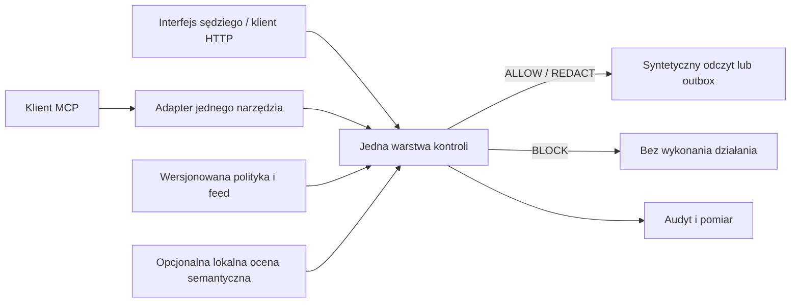

# AI Control Layer — raport decyzji badawczych

**Stan wiedzy: 3 października 2026.** To rekomendacje do zatwierdzenia przed implementacją, nie opis gotowego produktu ani zmiana kontraktów w [wymaganiach](requirements.md) i [architekturze](architecture.md). Badanie objęło obecny checkout (`08567c0`), dokumentację zainstalowanego Next.js 16.3.8, CodeGraph, Context7, oficjalne źródła projektów i krótki lokalny test. Nie wykonano migracji, wdrożenia ani zmian kodu produktu.

## Decyzja w skrócie

Pokaz referencyjny powinien dotyczyć **syntetycznego asystenta analityka**, który czyta dokument i proponuje wysłanie podsumowania. Warstwa kontroli sprawdza odczyt i działanie wysyłki przed wykonaniem. Sędzia może zmienić tekst dokumentu, odbiorcę, próg polityki lub wskaźnik zagrożenia; następnie widzi werdykt, rzeczywisty stan testowej skrzynki wysyłkowej, ślad audytowy i pomiar. „Wysłanie” zapisuje wyłącznie syntetyczny rekord, bez prawdziwej poczty lub dowolnego żądania HTTP. Rdzeń pozostaje niezależny od bankowości.

Rekomendowana topologia to **jedna funkcja oceny i egzekwowania w TypeScript**, wywoływana przez jawny endpoint HTTP oraz jeden adapter narzędzia MCP. Kontrolujemy wyłącznie działania przechodzące przez te wejścia i tak należy je opisywać sędziom. Nie deklarujemy uniwersalnej ochrony agentów ani proxy dla dowolnych modeli. Kod deterministyczny oraz centralna polityka wydają werdykt; model i sygnatury dostarczają ustalenia, nigdy uprawnienia.

Polityka powinna być czytelnym, wersjonowanym JSON-em z możliwością zmiany podczas działania. Supabase może przechowywać osobną sesję demo, politykę i audyt każdego odwiedzającego; lokalny i publiczny podgląd korzystają z tej samej ścieżki. **Nie trenować Laya podczas 24-godzinnej budowy.** Zadaniowy checkpoint można sprawdzić lokalnie jako opcjonalny sygnał semantyczny. Niedostępność semantyki musi być widoczna i obsłużona polityką; nie wolno podmieniać jej na wynik testowego mocka w pokazie.

Oficjalna [strona zadania](https://hackyeah.pl/tasks-prizes) mówi, że zgłoszenie AI Control Layer musi być po angielsku. Użytkownik potwierdził angielski interfejs sędziowski; przed pracą UI integrator powinien jawnie uzgodnić tę zmianę z regułą polskiego UI w `AGENTS.md`. Czterostronicowego briefu partnera nie znaleziono w repozytorium ani w przeszukanych lokalnych katalogach. [Wymagania zespołu](requirements.md) są na razie źródłem szczegółów i wag; zgodność z pełnym briefem pozostaje do potwierdzenia.

## Wybór scenariusza i miejsca kontroli

Oceny poniżej są **subiektywną oceną potencjału w 24 godziny**, nie wynikiem produktu ani przewidywaną oceną sędziów. Pięć ocen w kolumnie `B/A/R/T/P` oznacza kolejno bezpieczeństwo, architekturę i wydajność, raportowanie, testy oraz praktyczność. Skala 1–5 stosuje wagi z wymagań: 30%, 20%, 20%, 15% i 15%.

| Scenariusz                                | B/A/R/T/P | Wynik ważony | Powód                                                                                                                                                                                              |
| ----------------------------------------- | --------- | -----------: | -------------------------------------------------------------------------------------------------------------------------------------------------------------------------------------------------- |
| Dokument analityka → kontrolowana wysyłka | 5/4/5/5/5 |    **4,8/5** | Jedna ścieżka pokazuje uprawnienia, pośredni prompt injection, eksfiltrację, budżet, decyzję przed działaniem i audyt. Syntetyczny odbiorca daje sprawdzalny skutek bez ryzyka prawdziwej wysyłki. |
| Inbox klienta → odpowiedź                 | 4/4/4/4/3 |        3,9/5 | Zrozumiały przepływ, ale prawdziwa integracja poczty, dostęp do kont i dane osobowe wydłużają budowę. Symulacja jest mniej przekonująca.                                                           |
| Agent programistyczny → wykonanie kodu    | 4/3/3/4/2 |        3,3/5 | Mocny przykład zagrożenia, lecz bezpieczna izolacja procesu, plików i sieci to osobny projekt.                                                                                                     |

| Topologia                                     | B/A/R/T/P | Wynik ważony | Co rzeczywiście obejmie                                              | Granica                                                                             |
| --------------------------------------------- | --------- | -----------: | -------------------------------------------------------------------- | ----------------------------------------------------------------------------------- |
| **Wspólny silnik + HTTP + jeden adapter MCP** | 4/4/5/5/4 |    **4,4/5** | Dwa jawnie zarządzane działania i żądania MCP do własnego narzędzia. | Inne narzędzia i bezpośrednie API pozostają poza kontrolą do czasu integracji.      |
| Wrapper SDK bez MCP                           | 3/4/4/4/5 |        3,9/5 | Wywołania aplikacji, która świadomie używa wrappera.                 | Słabszy dowód integracji z cudzym klientem.                                         |
| Ogólny gateway/proxy                          | 5/3/4/3/2 |        3,7/5 | Potencjalnie więcej ruchu HTTP/modeli/narzędzi.                      | Autoryzacja, streaming, formaty protokołów i tajne dane zużyją większość 24 godzin. |

Oficjalny [MCP TypeScript SDK v2](https://github.com/modelcontextprotocol/typescript-sdk/blob/main/docs/serving/http.md) daje bezstanowy handler `Request → Response` i nową instancję narzędzi dla każdego żądania, więc pasuje do trasy Next.js. SDK **nie sprawdza Host, Origin ani tokenu**; adapter musi to zrobić przed przekazaniem żądania. [MCP Inspector](https://github.com/modelcontextprotocol/modelcontextprotocol/blob/main/docs/docs/2026-07-28/tools/inspector.mdx) może niezależnie wywołać narzędzie. Warstwa MCP nie stanowi granicy bezpieczeństwa sama z siebie. Licencja SDK: [MIT dla istniejącego kodu i Apache-2.0 dla nowych wkładów](https://github.com/modelcontextprotocol/typescript-sdk/blob/main/LICENSE).

## Technologie i repozytoria

| Ranga | Zasób                                                                                                                                              | Decyzja                                                | Licencja / dopasowanie / główne ryzyko                                                                                                                                                                                                                                                                                                                                 |
| ----- | -------------------------------------------------------------------------------------------------------------------------------------------------- | ------------------------------------------------------ | ---------------------------------------------------------------------------------------------------------------------------------------------------------------------------------------------------------------------------------------------------------------------------------------------------------------------------------------------------------------------- |
| 1     | Obecny Next.js 16.3.8, React 19, Supabase JS/SSR, Vercel i `shared/ui`                                                                             | **Użyć**                                               | Już w `package.json`; lokalna dokumentacja Next.js potwierdza Route Handlers. CodeGraph pokazuje szkielet funkcji i brak API warstwy kontroli. Nie dodawać drugiego frameworka aplikacji.                                                                                                                                                                              |
| 2     | [MCP SDK v2](https://github.com/modelcontextprotocol/typescript-sdk) + Inspector                                                                   | **Dodać tylko do integracji**                          | MIT/Apache-2.0; niewielki zakres: jedno narzędzie, jedna trasa. Pełny proxy MCP odłożyć.                                                                                                                                                                                                                                                                               |
| 3     | [Agent Threat Rules](https://github.com/Agent-Threat-Rule/agent-threat-rules)                                                                      | **Pożyczyć kilka jawnie przypiętych reguł/fixture'ów** | [MIT](https://github.com/Agent-Threat-Rule/agent-threat-rules/blob/main/LICENSE). Jego [ograniczenia](https://github.com/Agent-Threat-Rule/agent-threat-rules/blob/main/LIMITATIONS.md) obejmują parafrazy, kontekst i inne języki. Edytowalny feed powinien przyjmować bezpieczne literały, nie dowolny regex wykonywany w wątku żądania. Zachować pochodzenie reguł. |
| 4     | [OWASP GenAI LLM Top 10 2026](https://github.com/GenAI-Security-Project/GenAI-LLM-Top10/blob/main/2026/README.md)                                  | **Użyć do mapy testów**                                | Taksonomia i przykłady, nie silnik detekcji. Przy kopiowaniu treści respektować CC BY-SA 4.0.                                                                                                                                                                                                                                                                          |
| 5     | [Laya](https://github.com/NandhaKishorM/laya) i [sentinel-laya](https://huggingface.co/3p3r/sentinel-laya)                                         | **Sprawdzić lokalnie, poza ścieżką krytyczną**         | Oba Apache-2.0. Checkpoint Sentinel jest angielski; publikowane metryki pochodzą od autora i nie dowodzą skuteczności tutaj.                                                                                                                                                                                                                                           |
| 6     | [Promptfoo](https://www.promptfoo.dev/docs/providers/http/) / [AgentDojo](https://github.com/ethz-spylab/agentdojo)                                | **Pożyczyć sposób testowania, nie wdrażać teraz**      | Oba MIT. Promptfoo może testować HTTP bez płatnego modelu, lecz obecny `node:test` jest szybszą ścieżką do wymaganej komendy. AgentDojo inspiruje pośrednie ataki, ale pełny harness wymaga środowiska Python i agenta.                                                                                                                                                |
| 7     | [OPA/Rego Wasm](https://www.openpolicyagent.org/docs/wasm)                                                                                         | **Odłożyć**                                            | Apache-2.0; silny przyszły adapter polityk, ale rekompilacja Rego utrudnia sędziemu natychmiastową edycję. JSON + mały deterministyczny evaluator lepiej odpowiada temu pokazowi.                                                                                                                                                                                      |
| 8     | [Presidio](https://github.com/data-privacy-stack/presidio)                                                                                         | **Odłożyć**                                            | MIT; dobry kandydat do przyszłej detekcji PII, ale Python/sidecar i jego konfiguracja zwiększają liczbę usług. Projekt przechodzi do organizacji Data Privacy Stack. Proste sygnatury w demo nie będą przedstawiane jako pełna ochrona PII.                                                                                                                            |
| 9     | [OpenTelemetry JS](https://github.com/open-telemetry/opentelemetry-js) / [Langfuse](https://github.com/langfuse/langfuse)                          | **Odłożyć**                                            | OTel Apache-2.0, Langfuse OSS MIT z wyjątkami EE. Dla jednego wycinka wystarczą czasy etapów i własny audyt. Samodzielny Langfuse wymaga kilku usług; później można dodać eksport OTel.                                                                                                                                                                                |
| 10    | [ProtectAI DeBERTa v2](https://huggingface.co/protectai/deberta-v3-base-prompt-injection-v2) / [LLM Guard](https://github.com/protectai/llm-guard) | **Nie wybierać jako podstawy**                         | Model jest angielski i ograniczony do prompt injection; repo LLM Guard jest zarchiwizowane. Może służyć wyłącznie jako dodatkowy punkt porównania.                                                                                                                                                                                                                     |

Zainstalowane narzędzia **CodeGraph** i **Context7** przyspieszyły przegląd kodu i aktualnej dokumentacji. Repozytoryjne `hackyeah-security-review`, `hackyeah-db-review` i `hackyeah-browser-qa` są właściwe do późniejszego przeglądu zmian. Agent Reach i Ponytail są narzędziami pracy zespołu, nie zależnościami produktu. Nie znaleziono powodu, by instalować dodatkowy plugin aplikacyjny do samej warstwy kontroli.

## Model semantyczny i decyzja o dostrajaniu

Bazowy Laya nie powinien sam decydować o blokadzie. Autor raportuje na 116 odłożonych przykładach prompt injection trafność **0,698** dla modelu angielskiego i **0,578** dla wielojęzycznego oraz ostrzega przed nadmierną pewnością i słabym wynikiem zero-shot w innych zadaniach ([wyniki i ograniczenia](https://github.com/NandhaKishorM/laya#honest-limits)). [sentinel-laya](https://huggingface.co/3p3r/sentinel-laya) raportuje średnie F1 **0,924** na pięciu zewnętrznych zbiorach, lecz recall na jednym zbiorze to **0,593**; są to wyniki wydawcy, na GPU RTX 3090, po angielsku. Nie przenosimy ich na polskie wejścia ani lokalne opóźnienie. Laya udostępnia własne [`POST /v1/systemone`](https://github.com/NandhaKishorM/laya/blob/main/docs/http-api.md), nie endpoint kompatybilny z OpenAI Chat Completions.

Lokalny komputer ma Apple M5 Pro, 48 GB RAM i Python 3.12. [Istniejący launcher Daybase](</Users/julian/Documents/ChatGPT/Personal app/tools/laya/README.md>) wskazuje przypięte źródło i model, ale nie ma środowiska `.venv`, pakietu `laya`, `torch`, `transformers` ani pobranych wag. Uruchomiono tylko jego dwa testy ograniczenia adresów lokalnych: **2/2 przeszły**. Nie uruchomiono inferencji, nie zmierzono opóźnienia i nie wykonano testu dwujęzycznego. Próby użycia pakietu MCP z cache npm zakończyły się `ENOTCACHED`; zgodność handlera oceniono na podstawie oficjalnego API, bez lokalnego testu protokołu.

**Werdykt fine-tuningowy: nie w 24-godzinnej ścieżce krytycznej.** [Instrukcja Laya](https://github.com/NandhaKishorM/laya/blob/main/docs/finetune.md) wymaga przygotowania `state/questions/gold`, osobnego zbioru kalibracyjnego i testowego; demonstracyjny trening na 2×T4 trwa kilka minut dopiero po przygotowaniu danych, większy około 4–5 godzin. Nie ma w projekcie gotowego, legalnie zweryfikowanego zbioru etykiet bezpieczeństwa. Najpierw sprawdzić gotowy checkpoint na własnych, odłożonych przykładach polskich i angielskich. Jeśli dostrajanie wróci po demo, warunkiem jest lepszy recall przy niepogorszonej liczbie fałszywych alarmów, kalibracja i udokumentowany oddzielny test. Sygnał modelu pozostaje wymienialny; dla polskiego tekstu angielski Sentinel powinien się wstrzymać, a polityka obsłużyć brak oceny.

## Środowisko, dostęp, audyt i mierzenie

**Rekomendacja:** Supabase Auth anonymous per odwiedzający, RLS z `auth.uid()` dla jego konfiguracji i odczytu audytu oraz osobny, serwerowy klient z nowym kluczem `sb_secret_…` wyłącznie dla uprzywilejowanego zapisu audytu i syntetycznego skutku działania. [Supabase](https://supabase.com/docs/guides/auth/auth-anonymous) rozróżnia anonimowego użytkownika od publicznego klucza `anon`; jego sesja ma własne ID. [Klucz `sb_secret_…` omija RLS](https://supabase.com/docs/guides/getting-started/api-keys), dlatego musi pozostać tylko na serwerze, po weryfikacji użytkownika i z minimalnym zakresem użycia. To wymaga **jawnej zmiany obecnego setupu**, który przyjmuje tylko klucz publikowalny; bez tego bezpośredni zapis audytu przez przeglądarkę byłby łatwy do podrobienia. Nowe tabele nadal wymagają RLS i sprawdzonych polityk. Supabase zaleca ochronę przed nadużyciem anonimowych rejestracji; bez niej publiczny podgląd powinien mieć ograniczony dostęp. Lokalne pliki lub pamięć procesu są prostsze, ale nie zapewniają trwałego audytu na publicznym Vercel; nowy Redis/KV zwiększa liczbę usług.

Obecny checkout **nie ma `.env.local` ani powiązania `.vercel`**, a [rejestr migracji](../../supabase/APPLIED.md) nie potwierdza nawet wykonania pierwszej migracji. Deklarowany dostęp zespołu do usług nie jest jeszcze lokalnie zweryfikowany. Jeden projekt Supabase dla local/preview/production oznacza wspólne dane; testy muszą używać osobnych syntetycznych sesji, a migracje wykonuje tylko integrator. Vercel ma ograniczenia pamięci i czasu funkcji oraz standardowego pakietu; od 2026 istnieje [opcja większych funkcji](https://vercel.com/kb/guide/troubleshooting-function-250mb-limit), ale nie uzasadnia to wpychania PyTorch i checkpointu do wdrożenia w tak krótkim terminie. Szczegóły zależą od planu i konfiguracji projektu ([limity](https://vercel.com/docs/functions/limitations)). Lokalny Laya nie będzie osiągalny z publicznego Vercel bez osobnej, jawnie zaprojektowanej usługi; podgląd ma uczciwie pokazywać brak tego dostawcy.

Audyt musi zawierać trace ID, wersje polityki i feedu, fakt deterministyczny, ocenę semantyczną lub jej brak, werdykt, powód, etap i czas, bez surowych sekretów. Metryki P50/P95/P99 i przepustowość można obliczyć z rzeczywistych pomiarów `performance.now()` lub [Node perf_hooks](https://nodejs.org/api/perf_hooks.html); podawać też liczbę próbek, środowisko, cold start i czas modelu osobno. Nie ma obecnie żadnego wyniku wydajności naszej warstwy.

## Testy, kolejność 24 godzin i granice deklaracji

Minimalny zestaw `node:test` powinien sprawdzać **skutek działania**: dozwolona operacja daje rekord testowej skrzynki, zablokowana nie; obcy zasób, niedozwolony odbiorca, sekret, pośrednie polecenie w dokumencie, przekroczony budżet i limit kroków, zmiana polityki i feedu, awaria modelu oraz benign cytat przypominający atak. Mapować przypadki do OWASP LLM01, LLM02, LLM03, LLM06 i LLM10. [OWASP Agent Security Regression Harness](https://github.com/OWASP/Agent-Security-Regression-Harness) jest wzorem sprawdzania śladu i rzeczywistego wywołania narzędzia, nie konieczną zależnością. Regexy lub wskaźniki ATR oznaczają sygnał sygnaturowy, nie semantyczną obronę.

| Priorytet   | Efekt i bramka rezygnacji                                                                                                                                                                                                                 |
| ----------- | ----------------------------------------------------------------------------------------------------------------------------------------------------------------------------------------------------------------------------------------- |
| **P0**      | Kontrakt interakcji, centralny werdykt, dwa rzeczywiście przechwycone działania, polityka zmieniająca wynik, budżet, audyt i testy skutku. Bez tego nie przechodzić do ozdób ani modelu.                                                  |
| **P1**      | Ekran sędziowski, eksport śladu, jeden prawdziwy adapter MCP, pomiar etapów i próba na publicznym preview. Jeśli MCP nie działa po krótkim eksperymencie integracyjnym, zostawić udokumentowane HTTP i nie twierdzić, że MCP jest gotowe. |
| **P2**      | Lokalna semantyka Sentinel Laya po smoke teście i małym odłożonym zestawie; jeśli pakiety/wagi, jakość lub opóźnienie blokują pokaz, wyświetlić `unavailable` i kontynuować deterministyczny wycinek.                                     |
| **Po demo** | Fine-tuning, ogólny gateway, wiele frameworków agentowych, pełny PII engine, OPA/OTel/Langfuse i duże benchmarki.                                                                                                                         |

Trzyminutowy pokaz: legalny odczyt i wysyłka → wrogi tekst w dokumencie i zablokowany skutek → zmiana uprawnienia/progu lub wskaźnika → ponowne żądanie, wersjonowany audyt i zmierzony narzut. Sędzia może podać własny tekst i odbiorcę; nie kodować jego promptów jako wyjątków. Prawdziwe wysłanie poczty, ochrona każdego MCP, pełne PII, odporność na wszystkie języki i gotowość produkcyjna **nie są deklaracjami tego demo**.

### Nierozstrzygnięte zależności przed rozpoczęciem prac

1. Integrator i właściciele trzech katalogów funkcji muszą dostać konkretne osoby/loginy zgodnie z `AGENTS.md`.
2. Zespół powinien sprawdzić oryginalny czterostronicowy brief partnera oraz potwierdzić zmianę języka sędziowskiego w regule repozytorium.
3. Integrator musi potwierdzić rzeczywistą konfigurację Supabase/Vercel, politykę użycia klucza serwerowego, status bazowej migracji i ochronę publicznych anonimowych sesji.
4. MCP i Laya wymagają osobnych, małych prób uruchomieniowych; ten raport potwierdza API i lokalne warunki wstępne, **nie** działającą integrację ani jakość modelu.

**Kontrola dokumentu:** `npm run check:fast` przeszedł, w tym 12 testów narzędziowych. Dwa uruchomienia pełnego `npm run check` zatrzymały się w istniejącym buildzie Next/Turbopack przy próbie otwarcia lokalnego portu przez proces CSS (`Operation not permitted`), także po uruchomieniu z podwyższonymi uprawnieniami narzędzia. Nie jest to dowód działania ani niedziałania przyszłej warstwy kontroli.
