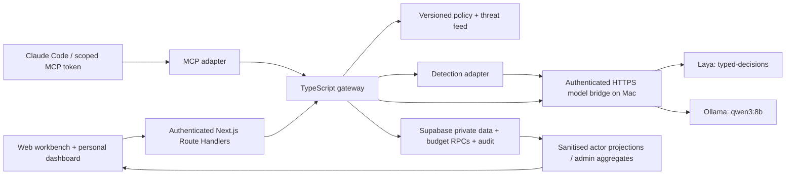

# Architecture

Status: accepted target; starter only is implemented. The product is a **server-side gateway**, exposed through thin HTTP Route Handlers and an MCP adapter. The internal web application is one client.

## Deployment and boundaries

- Existing Next.js/React/TypeScript/Tailwind application on Vercel. Node Route Handlers orchestrate requests; browser code never holds bridge/service credentials. Supabase Auth sessions are verified server-side.
- Supabase Postgres holds policy, membership, excerpts, runs, reservations and audit. Private Storage holds quarantine originals and newly generated exports. Local, preview and production share this one project: branches do not isolate data.
- M5 Pro Mac runs Ollama and Laya on loopback. A small authenticated Python bridge exposes only fixed generation, semantic assessment and health routes through an HTTPS tunnel. Model ports stay private. Mac must remain awake and connected. No high-availability claim.
- Connector imports read only a fixed dataset in this same Supabase project. No caller-provided connection string, SQL, URL, table name or secret.
- Stateful run execution occurs during a bounded HTTP request. A durable run record and lease support progress and uncertain outcomes. This is not a background queue: no dependency on work continuing after a serverless response.

### Trust boundaries

1. **Browser/MCP → server:** all bodies, uploaded data, tool arguments and model outputs untrusted. Resolve actor and scope server-side. Cookie mutations require exact allowed Origin checks; bearer clients use scoped tokens and explicit audience.
2. **Gateway → database:** privileged credentials can bypass RLS, so server code must check organisation, actor, role and deal for each operation. SQL RPCs enforce atomic invariants. Browser RLS has no SELECT on raw or excerpt tables.
3. **Gateway → model bridge:** server-only bearer token, HTTPS, fixed host/routes, bounded JSON, no arbitrary model/path/command, no model-controlled network destinations. Bridge has no Supabase key.
4. **Raw data → approved excerpts:** provenance and immutable version retained; classification and processing status independent. Semantic scores cannot change permissions.
5. **Model output → user/export:** citations validated against supplied context; output checked before exposure. Private reasoning is neither requested nor shown.
6. **Operational logs → dashboards:** structured safe reason codes and metrics; no prompts, secret values, raw text or denied document titles in personal traces.

## Components and ownership

| Owner      | Files                                                                                   | Responsibilities                                                                                              |
| ---------- | --------------------------------------------------------------------------------------- | ------------------------------------------------------------------------------------------------------------- |
| Integrator | `src/shared/**`, `src/app/**`, `supabase/**`, `scripts/**`, config/dependencies/CI/docs | Auth, contracts, policy engine, accounting, persistence, routes, composition, MCP, integration tests, release |
| Builder A  | `src/features/workbench/**`                                                             | Chat, sources/upload, review, policy/feed, export UI and feature tests                                        |
| Builder B  | `src/features/detection/**`                                                             | Parsers, deterministic findings, Laya adapter, Python runtime bridge, frozen evaluation and feature tests     |
| Builder C  | `src/features/audit/**`                                                                 | Personal/admin dashboards, trace presentation, metrics and audit-download interaction, feature tests          |

App imports a feature only through its `index.ts`. Features import shared, never another feature/app. Shared never imports features/app. Integrator composes the detection implementation into the shared gateway using injected interfaces in a server-only app composition module. Workbench/audit use the shared typed HTTP client; they do not import gateway composition. Provider-specific bridge code lives under detection; integrator owns deployment wrappers.

## Future scaling, bounded claims

Atomic database state supports multiple HTTP instances. It does not make the single Mac highly available. Replace the model bridge with a deployed service behind the same interface; separate job workers when synchronous limits are exceeded; add tenant provisioning and load tests later. MCP protects the data/tools served by this gateway, not all activity or spend inside an external host. No commercial integration is required to demonstrate budget accounting using a labelled simulator.
