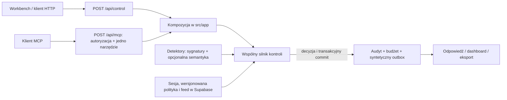

# AI Control Layer — specyfikacja techniczna demo

**Status: rekomendowany kontrakt do przeglądu zespołu, 3 października 2026.** Ten dokument opisuje plan implementacji, nie gotową funkcję. Zakres zadania i kryteria oceny są w [wymaganiach](requirements.md), niezmienniki w [architekturze](architecture.md), a uzasadnienie wyboru i źródła w [raporcie badawczym](research-decisions.md). [Centralny przegląd technologii](technology-overview.md) podaje stos i status zależności, a [podział pracy](../team/implementation-plan.md) właścicieli i kolejność. Oryginalny czterostronicowy brief partnera trzeba porównać z tym kontraktem, gdy będzie dostępny.

## 1. Wynik, który pokażemy

Sędzia uruchamia syntetycznego asystenta analityka. Może edytować tekst dokumentu, treść proponowanego podsumowania, odbiorcę, centralną politykę i feed zagrożeń. Klient referencyjny próbuje wykonać kolejno `document.read` i `message.send`. Każda próba przechodzi przez tę samą funkcję kontroli. „Wysłanie” tworzy rekord w testowym outboxie; nie uruchamia poczty ani dowolnego żądania sieciowego. UI pokazuje werdykt, powody, wersję konfiguracji, rzeczywisty stan outboxu, audyt i zmierzone czasy.

Klient referencyjny jest deterministycznym orkiestratorem dwóch działań, a nie deklaracją samodzielnego agenta LLM. Ta sama ścieżka ma być wywoływalna przez HTTP i jedno narzędzie MCP. W pokazie opisujemy **zarządzane** działania i wskazujemy granicę integracji: bezpośrednie wywołanie obcego API albo innego narzędzia poza adapterem nie jest przechwytywane.

### Trzyminutowa ścieżka

1. Legalny dokument i odbiorca: odczyt oraz wysyłka przechodzą; w outboxie pojawia się jeden rekord.
2. Sędzia wstawia do dokumentu polecenie zmiany odbiorcy lub wpisuje niedozwolony cel: polityka blokuje odpowiednie działanie; liczba rekordów outboxu nie rośnie.
3. Sędzia zmienia limit lub wskaźnik feedu i ponawia próbę: wynik zmienia się bez przebudowy; audyt pokazuje nowe wersje.
4. Widok techniczny pokazuje trace i czasy, a eksport zawiera te same fakty bez surowych sekretów.

## 2. Topologia i granica egzekwowania

`src/shared/control/**` zawiera normalizację, typy, walidację polityki, evaluator, bramkę wykonania, pomiary oraz interfejsy dostawców. Przyjmuje identyfikator działania i zarejestrowany executor; nie importuje domeny pokazu ani nie zna kodem nazw `document.read` i `message.send`. Rejestr dwóch executorów powstaje w kompozycji `src/app/**`. `src/features/detection/**` zwraca **ustalenia**; nie wykonuje działań i nie wydaje werdyktu. Trasy w `src/app/**` składają detektory, repozytoria i silnik przez publiczne `index.ts`. `src/features/workbench/**` i `src/features/audit/**` są prezentacją i nie zapisują outboxu. Wszystkie wejścia demonstracyjne używają tej samej bramki; brak osobnej ścieżki „demo allow”.

Next.js 16.3.8 Route Handlers działają na `Request`/`Response`; trasy kontroli i MCP używają Node runtime. Zależności pozostają zgodne z obecnym Next.js/React/TypeScript/Supabase. Integrator dodaje tylko niezbędny oficjalny [MCP TypeScript SDK v2](https://github.com/modelcontextprotocol/typescript-sdk), po próbie protokołu. `node:test` pozostaje podstawą testów; jeśli bezpośrednie uruchomienie modułów TypeScript okaże się kłopotliwe, integrator wybiera mały runner TS, bez nowego frameworka testowego. OPA, Presidio, OpenTelemetry, Langfuse, Promptfoo i pełny AgentDojo pozostają poza 24-godzinną ścieżką.

## 3. Kontrakty HTTP i typów

**Wejścia**: `POST /api/control` przyjmuje JSON o wersji kontraktu `1`, `operation: "document.read" | "message.send"`, `session_id` i parametry działania. Dla odczytu parametrem jest `document_id`; dla wysyłki `recipient_id`, `subject` i `body`. Wartości są ograniczane rozmiarem i walidowane na serwerze. Dokument i odbiorca należą do niewielkiego, syntetycznego katalogu sesji. Pole `actor_id`, rola, `owner_id`, trace ID i wersje polityki **nigdy nie są przyjmowane jako autorytatywne dane klienta**: serwer bierze użytkownika ze zweryfikowanej sesji albo krótkotrwałego tokenu integracyjnego, a pozostałe wartości z bazy i własnego generatora. Nieznana operacja lub zasób daje odmowę przed skutkiem.

`document_id` wskazuje pojedynczy dokument zapisany w `control_sessions`, a identyfikatory odbiorców są danymi syntetycznej allowlisty sesji. Odczyt zablokowany przez wskaźnik prompt injection kończy dwuetapowy bieg; dozwolona wysyłka zawsze ponownie sprawdza własną treść i odbiorcę, nawet jeśli wcześniej udał się odczyt. Dane wejściowe mają twardy limit 16 KiB na żądanie, 8 KiB na dokument i 2 KiB na treść wysyłki. Są to limity bezpieczeństwa serwera; niższe limity mogą pochodzić z polityki.

| Wejście                  | Właściciel                             | Zadanie                                                               |
| ------------------------ | -------------------------------------- | --------------------------------------------------------------------- |
| `POST /api/control`      | Integrator                             | Walidacja, autoryzacja, wspólna kontrola i wynik.                     |
| `POST /api/mcp`          | Integrator                             | Jedno narzędzie delegujące do tej samej kontroli; P1.                 |
| Server Actions workbench | Builder A, z usługą shared integratora | Tworzenie sesji i edycja dokumentu, polityki/feedu z kontrolą wersji. |
| `GET /api/audit/export`  | Integrator, z odczytem feature audytu  | Autoryzowany eksport własnej sesji; P1.                               |

**Wynik**: stabilna odpowiedź zawiera `trace_id`, `operation`, `verdict`, `reason_codes`, bezpieczne `findings`, `policy_version`, `feed_version`, `semantic_status`, `budget_after`, `result`, `effect` oraz `timings_ms`. `result` zawiera przefiltrowaną treść tylko po dozwolonym odczycie; `effect` zawiera ID outboxu tylko po potwierdzonej wysyłce, inaczej jest `null`. Błędy oczekiwane nie ujawniają komunikatu SQL, kluczy ani stosu. Jeden trace łączy oba kroki uruchomienia, a każde działanie ma własne ID zdarzenia. Typy trwałych encji używają `snake_case`, zgodnie z kolumnami; prywatne typy UI pozostają w feature'ach.

**Werdykty w v1**:

| Werdykt  | Skutek w tej wersji                                                                                          |
| -------- | ------------------------------------------------------------------------------------------------------------ |
| `ALLOW`  | Wykonaj tylko jawnie dozwolony odczyt albo zapis do syntetycznego outboxu.                                   |
| `WARN`   | Wykonaj dozwoloną, niskiego ryzyka operację i pokaż powód; ostrzeżenie nie omija odmowy uprawnień.           |
| `REDACT` | Zwróć odczyt z usuniętymi dopasowanymi fragmentami; nie zapisuj oryginalnej treści w odpowiedzi ani audycie. |
| `BLOCK`  | Nie wykonuj działania; zapisz odmowę i powód.                                                                |

`ESCALATE` i `ROUTE` z architektury pozostają nazwami przyszłych możliwości: w 24h nie ma odbiorcy eskalacji ani drugiego modelu. Żaden błąd nie zostaje po cichu przekształcony w `ALLOW`.

**Priorytet reguł**: nieważna tożsamość, zasób, odbiorca, operacja, brak polityki, przekroczony budżet i błąd wymaganej trwałej ścieżki kończą się `BLOCK`. Następnie sprawdzane są wskaźniki feedu i fakty deterministyczne; sygnał semantyczny może podwyższyć ryzyko zgodnie z polityką, ale nie zmienia odmowy na zgodę. `REDACT` dotyczy tylko jawnie zdefiniowanych fragmentów na odczycie. `WARN` jest możliwy tylko w granicach uprzednio dozwolonej operacji. Remis rozstrzyga surowszy werdykt.

## 4. Polityka, feed i semantyka

Każda sesja ma jeden dokument JSON polityki z monotonicznym `policy_version` oraz osobny JSON feedu z `feed_version`. Edycja odbywa się przez uwierzytelnioną trasę/akcję serwerową z walidacją schematu i warunkiem „zmień tylko wersję, którą odczytałeś”. Żądanie kontroli pobiera **jedną migawkę** polityki i feedu; audyt zapisuje użyte wersje. Nie ma cache'u między żądaniami na starcie. Błąd walidacji lub brak konfiguracji blokuje działanie i jest widoczny w UI. Seed zawiera poziomy `strict` i `balanced`, ale szczegółowe parametry są danymi polityki, nie warunkami rozsianymi po kodzie.

Minimalne pola polityki: dozwolone operacje/zasoby/odbiorcy, maksymalny rozmiar wejścia, limit żądań i tokenów na sesję, limit kroków uruchomienia, decyzje dla kategorii ustaleń, próg semantyczny i zachowanie przy niedostępnej semantyce. Seed ma 20 żądań, 8000 szacowanych tokenów i dwa kroki na bieg. `balanced` dopuszcza czystą deterministycznie wysyłkę tylko do syntetycznego odbiorcy przy niedostępnej semantyce jako `WARN`; `strict` blokuje taką wysyłkę. Żaden tryb nie zezwala na nieznanego odbiorcę. Domyślna mapa: wskaźnik prompt injection blokuje odczyt; sekret podlega redakcji na odczycie i blokadzie przy wysyłce. W v1 tokeny oznaczają **szacunek `ceil(liczba bajtów UTF-8 / 4)`**, nie wynik tokenizera ani koszt API. Bez wywołania płatnego modelu koszt API wynosi zero; nie wyświetlamy fikcyjnych oszczędności. Feed v1 ma najwyżej 50 literałów po maksymalnie 128 znaków, z `id`, `category`, `source`, `severity` i `enabled`; serwer stosuje normalizację Unicode i porównanie bez rozróżnienia wielkości liter. W UI nie ma wykonywalnego regexu, JavaScriptu ani URL-a do pobierania arbitralnego feedu.

Detektor `src/features/detection` oddaje fakty typu `finding` z kategorią, źródłem, krótkim bezpiecznym opisem i zakresem redakcji, bez surowej tajnej wartości. Adapter semantyczny zwraca `score`, `label`, `provider`, `model_version`, `duration_ms` albo status `unavailable/timeout/abstain`. Kod polityki dopiero mapuje wynik na werdykt. Publiczny preview ma jawny stan `unavailable`, dopóki nie istnieje osobna osiągalna usługa. Lokalny [sentinel-laya](https://huggingface.co/3p3r/sentinel-laya) jest opcjonalnym eksperymentem dla angielskiego tekstu po teście startu, opóźnienia i przykładów odłożonych. Dla polskiego tekstu ten checkpoint abstynuje. Brak wyniku modelu nie jest zastępowany mockiem w pokazie. Strojenie Laya jest odłożone po demo.

## 5. Tożsamość, baza i niezmienniki zapisu

Supabase Auth anonymous daje każdemu odwiedzającemu własne `auth.uid()`. Minimalne tabele to `control_sessions` (właściciel, syntetyczny dokument, polityka/feed i wersje, liczniki), `control_audit_events` (append-only ślad) i `demo_outbox` (jedyny skutek wysyłki). Wszystkie mają RLS. Dla roli `authenticated` jawna polityka `SELECT` ogranicza sesje, audyt i outbox do `owner_id = (select auth.uid())`; brak bezpośrednich `INSERT/UPDATE/DELETE` z przeglądarki. Dla `anon` nie ma dostępu. Indeksy wynikają z odczytu po `owner_id`, `session_id` i sortowania audytu po czasie. Audyt zawiera kody powodów, wynik, wersje, czasy i skróty/metryki danych; nie pełny dokument, sekret ani token integracyjny.

**Zmiana wymagana względem obecnego setupu**: poza `sb_publishable_…` integrator dodaje osobny `sb_secret_…` tylko do środowiska serwerowego i dopuszcza go w kodzie serwera, nie w `NEXT_PUBLIC_*`. Dla żądania przeglądarki serwer weryfikuje użytkownika przez `auth.getUser()`; dla MCP weryfikuje podpisany token i wyprowadza z niego właściciela sesji. Dopiero po sprawdzeniu własności może użyć klienta uprzywilejowanego do zwalidowanego zapisu. Klucz omija RLS, więc każde zapytanie musi jawnie ograniczać `owner_id` i `session_id`; RLS pozostaje niezależnym ograniczeniem odczytu. [Oficjalna dokumentacja kluczy Supabase](https://supabase.com/docs/guides/getting-started/api-keys) opisuje tę różnicę. Integrator aktualizuje `docs/team/setup.md` i walidację środowiska w osobnym PR przed użyciem klucza.

Decyzja, budżet, audit i efekt muszą być spójne przy współbieżnych żądaniach. Serwer ocenia migawkę, a transakcyjny zapis ponownie sprawdza wersję polityki i limit pod blokadą rekordu sesji, zwiększa licznik oraz zapisuje zdarzenie i ewentualny outbox razem. Przy konflikcie wersji żądanie dostaje kontrolowany wynik `retry/config_changed`; nie wykonuje starej decyzji. Przy awarii audytu lub zapisu budżetu nie wykonuje się wysyłki. Odmowa też zostawia audyt, jeśli baza jest dostępna; gdy baza nie działa, zwracamy błąd z trace ID i **nie twierdzimy**, że audyt zapisano. Tę operację realizuje jedna ograniczona funkcja bazy wywoływana tylko przez serwer, a nie seria niezależnych insertów z Route Handlera.

Publiczny podgląd wymaga potwierdzonego dostępu sędziów i zabezpieczenia przed masowym zakładaniem anonimowych sesji (np. ochrona deploymentu lub kod dostępu i globalny limit). Limit per użytkownik nie wystarcza do ochrony publicznego endpointu przed tworzeniem nowych kont. Wszystkie dane są syntetyczne, wspólna baza local/preview/production nie jest izolacją gałęzi, a migracje wykonuje tylko integrator po PR i wpisie w `supabase/APPLIED.md`.

## 6. MCP i inne wejścia

Adapter MCP rejestruje jedno narzędzie `control_action`, które przyjmuje ten sam zakres operacji i zwraca ten sam `trace_id`/werdykt. Przed przekazaniem do SDK trasa sprawdza metodę, Host/Origin zgodnie z konfiguracją deploymentu, format i rozmiar żądania oraz uwierzytelnienie. Dla klienta zewnętrznego integrator wydaje po uwierzytelnieniu krótko ważny token zakresowy dla jednej sesji; jego podpis/sekret pozostaje na serwerze. Token nie nadaje prawa do obcych sesji ani nie jest kluczem Supabase. Browser używa sesji i ochrony żądań zmieniających stan; nie ufa samemu ukryciu przycisku. Token MCP jest opcją integracyjną po działającym HTTP i przechodzi próbę z niezależnym klientem Inspector. SDK nie zastępuje autoryzacji.

## 7. Testy, dowody i granice deklaracji

Jedna komenda projektu uruchamia testy kontroli bez płatnego API. Testy modułowe obejmują dozwolony odczyt/wysyłkę, obcy zasób, niedozwolonego odbiorcę, wykryty sekret, pośredni prompt injection, benign cytat, przekroczone limity, zmianę polityki/feedu i awarię/abstencję semantyki. Test integracyjny sprawdza **skutek**: `BLOCK` nie zwiększa liczby rekordów outboxu, a `ALLOW` daje dokładnie jeden. Dodatkowe próby obejmują cudzy `owner_id` przez Supabase API, bezpośredni zapis przeglądarki, jednoczesne zużycie ostatniej jednostki budżetu, błąd audytu i konflikt wersji. Przypadki mapujemy do [OWASP LLM Top 10 2026](https://github.com/GenAI-Security-Project/GenAI-LLM-Top10/blob/main/2026/README.md), ale nie nazywamy tego pełną odpornością na taksonomię.

Pomiary zapisują rzeczywisty czas walidacji, detekcji, semantyki, polityki, transakcyjnego zapisu i całej obsługi. Raport pokazuje P50/P95/P99, liczbę próbek, środowisko, cold/warm i oddzielnie czas modelu. Narzut warstwy porównujemy z tym samym syntetycznym działaniem bez detekcji **tylko w izolowanym pomiarze**, nigdy jako ścieżkę użytkownika omijającą kontrolę. W publicznym demo bez Laya pokazujemy brak pomiaru modelu. Nie twierdzimy, że chronimy wszystkie modele, wszystkie narzędzia, pełne PII, dowolny język lub rzeczywistą pocztę.

## 8. Kryterium startu implementacji

Integrator z trzema builderami zatwierdza nazwy pól i zachowanie `ALLOW/WARN/REDACT/BLOCK`, po czym zamraża v1 kontraktów `src/shared/**` i schemat migracji. Właściciel potwierdza cztery osoby/loginy, Supabase/Vercel, dostęp do secret key i publiczny tryb wejścia sędziów. Angielski interfejs sędziowski jest potwierdzony przez użytkownika i zgodny z regułą `AGENTS.md`. Do czasu pozostałych potwierdzeń dokument jest decyzją techniczną do przeglądu, nie dowodem gotowości wdrożeniowej.
